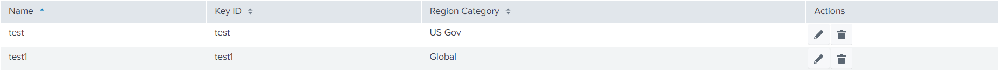

We can use this feature to map each field with meaningful value to display in the table. For example, the category field contains 1, 2, and 4 values, but when those values are displayed, the user might get confused as those values do not signify the meaning of their mapping. To avoid this confusion, the user can map each field with meaningful value as shown in the following example:

### Usage

```json
{
    "name": "account",
    "title": "Account",
    "table": {
        "header": [
            {
                "field": "name",
                "label": "Name"
            },
            {
                "field": "key_id",
                "label": "Key ID"
            },
            {
                "field": "category",
                "label": "Region Category",
                "mapping": {
                    "1": "Global",
                    "2": "US Gov",
                    "4": "China"
                }
            }
        ],
        "actions": [
            "edit",
            "delete"
        ]
    },
    "entity": [
        {
            "field": "name",
            "label": "Name",
            "type": "text",
            "required": true,
        },
        {
            "field": "key_id",
            "label": "Key ID",
            "type": "text",
        },
        {
            "field": "category",
            "label": "Region Category",
            "type": "singleSelect",
            "required": true,
            "defaultValue": 1,
            "options": {
                "disableSearch": true,
                "autoCompleteFields": [
                    {
                        "label": "Global",
                        "value": 1
                    },
                    {
                        "label": "GovCloud",
                        "value": 2
                    },
                    {
                        "label": "China",
                        "value": 4
                    }
                ]
            }
        }
    ]
}
```

### Output

This is how it looks in the UI:


