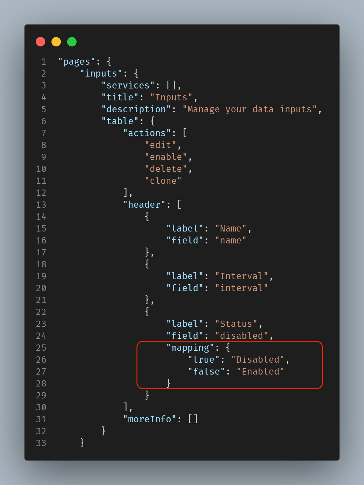

UCC allows you to map field values, for example, in the data collection field of input, if the user wants to display Enabled/Disabled instead of false/true, write the following in the table's header section:

```
"mapping": {
    "true": "Disabled",
    "false": "Enabled"
}
```

### Usage

Use mapping in the table header:

