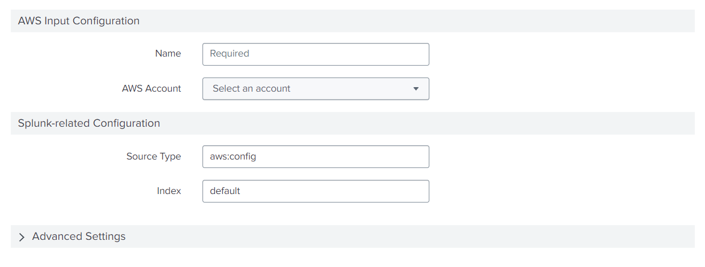

Using this functionality, the Inputs page form can be divided into distinct sections, each comprising relevant fields. If the `isExpandable` property is set to true in the global configuration file, the group will be in the [collapsible panel](https://splunkui.splunk.com/Packages/react-ui/CollapsiblePanel) type. 

The groups will be displayed at the bottom of the form.

### Properties
- `label` displays the title of a specific group.
- `fields` specifies the list of fields in a group. All fields must be present in the **entity**.
- `options`:
    - `isExpandable` can be used to hide/show fields of the group. The default value is **false**.
    - `expand` can be used to show all fields of the group while opening the form. The default value is **false**.
    
### Usage
```
{
  "name": "aws_config",
  "title": "Config",
  "groups": [
    {
      "label": "AWS Input Configuration",
      "options": {
        "isExpandable": false
      },
      "fields": [
        "name",
        "aws_account"
      ]
    },
    {
      "label": "Splunk-related Configuration",
      "options": {
        "isExpandable": false
      },
      "fields": [
        "sourcetype",
        "index"
      ]
    },
    {
      "label": "Advanced Settings",
      "options": {
        "expand": false,
        "isExpandable": true
      },
      "fields": [
        "polling_interval"
      ]
    }
  ],
  "entity": []
},
```
### Output
This is how it looks in the UI:

