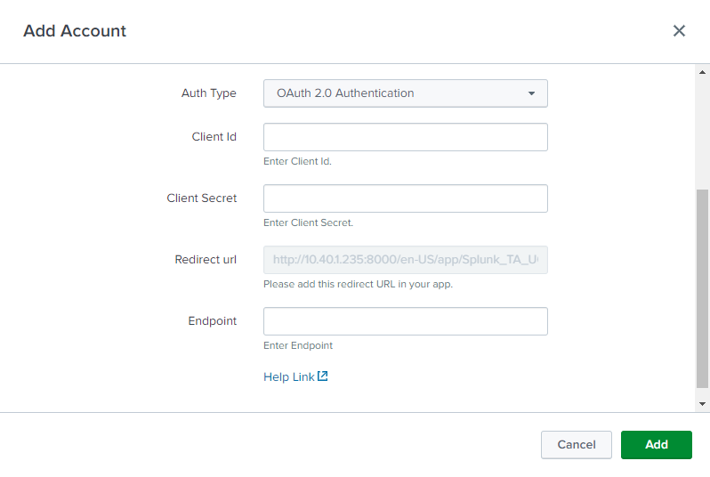

UCC allows you to add Auth support in the configuration page. In UCC, OAuth2.0 of the Authorization Code Flow `grant` type is being used. It only supports the standard parameters specified in [RFCP749](https://www.rfc-editor.org/rfc/rfc6749) for obtaining an authorization code.

Auth can be used inside the entity tag. Use `type: "oauth"` in the entity list and also need to specify the `options` next to the `type: "oauth"`.

### Properties

- `type` field value must be oauth.
- `options`:
    - `auth_type` must be present. It can have either ["basic", "oauth"] (If we want basic and oauth both support) or ["oauth"] (If we want oauth support only).
    - `basic` This must be present only if auth_type: ["basic"]
        - This will have list of fields you want to add in basic authentication flow. In the given example, it is username, password and security_token. 
        - **Please note that as of now, If you are selecting basic as auth_type then username and password fields are mandatory.**
    - `oauth` This will have list of fields you want to add in oauth authentication flow. In the given example, it is `client_id`, `client_secret`, `redirect_url`, `scope` and `endpoint`.
    - These fields are mandatory:
        - `client_id` this is client id for the your app for which you want auth
        - `client_secret` this is client secret for the your app for which you want auth
        - `redirect_url` this will show redirect url which needs to be put in app's redirect url.
        - `endpoint` this will be endpoint for which we want to build oauth support. For example for salesforce that will be either "login.salesforce.com" or "test.salesforce.com" or any other custom endpoint.
    - `auth_code_endpoint` this must be present and its value should be endpoint value for getting the auth_code using the app. If the url to get auth_code is https://login.salesforce.com/services/oauth2/authorize then this will have value /services/oauth2/authorize
    - `access_token_endpoint` this must be present and its value should be endpoint value for getting access_token using the auth_code received. If the url to get access token is https://login.salesforce.com/services/oauth2/token then this will have value /services/oauth2/token
    - `auth_label` this allow user to have custom label for Auth Type dropdown
    - `oauth_popup_width` width in pixels of the popup window that will open for oauth authentication (Optional, defaults to 600)
    - `oauth_popup_height` height in pixels of the popup window that will open for oauth authentication (Optional, defaults to 600)
    - `oauth_timeout` timeout in seconds for oauth authentication (Optional, defaults to 180 seconds)
    - `oauth_state_enabled` to include state for oauth authentication (default value is false)
    - `auth_endpoint_token_access_type` optional parameter that is mapped into value of token_access_type query param in authorisation url

    - Fields allowed in basic and oauth fields as of now:
        - `oauth_field`: This should be kept as it is and without any change.
        - `label`: This can be changed if the user wants to change the label of the field in UI.
        - `field`: For now this user must keep it as it is for mandatory fields as mentioned above.
        - `help` : This can be changed if user wants to change the help text displayed below field.
        - `encrypted` : This should be true if user wants that particular field encrypted else no need to have this parameter.
        - `required`: To specify whether the field is required or not. The default value is true.
        - `options`:
            - `placeholder`: The placeholder for the field.

> [!WARNING]
> [Placeholder](https://splunkui.splunkeng.com/Packages/react-ui/Text?section=develop) attribute is deprecated and will be removed in one of the following versions. Instead, we recommend using "help" attribute.

### Usage

```
"configuration": {
    "title": "Configurations",
    "description": "Configure your servers and templates.",
    "tabs": [
        {
            "name": "account",
            "title": "Account",
            "entity": [
                {
                    "field": "name",
                    "label": "Name",
                    "type": "text",
                    "required": true,
                    "help": "Enter a unique name for each Crowdstrike falcon host account.",
                },
                {
                    "type": "oauth",
                    "field": "oauth",
                    "label": "Not used",
                    "options": {
                        "auth_type": [
                            "basic",
                            "oauth"
                        ],
                        "basic": [
                            {
                                "oauth_field": "username",
                                "label": "User Name",
                                "field": "username",
                                "help": "Enter Account name."
                            },
                            {
                                "oauth_field": "password",
                                "label": "Password",
                                "field": "password",
                                "encrypted": true,
                                "help": "Enter Password."
                            },
                            {
                                "oauth_field": "security_token",
                                "label": "Securtiy Token",
                                "field": "security_token",
                                "encrypted": true,
                                "help": "Enter Security Token."
                            }
                        ],
                        "oauth": [
                            {
                                "oauth_field": "client_id",
                                "label": "Client Id",
                                "field": "client_id",
                                "help": "Enter Client Id."
                            },
                            {
                                "oauth_field": "client_secret",
                                "label": "Client Secret",
                                "field": "client_secret",
                                "encrypted": true,
                                "help": "Enter Client Secret."
                            },
                            {
                                "oauth_field": "redirect_url",
                                "label": "Redirect url",
                                "field": "redirect_url",
                                "help": "Please add this redirect URL in your app."
                            },
                            {
                                "oauth_field": "scope",
                                "label": "Scope",
                                "field": "scope",
                                "help": "Enter the scope for the authorization code with ',' separating each scope.",
                                "required": false
                            },
                            {
                                "oauth_field": "endpoint",
                                "label": "Endpoint",
                                "field": "endpoint",
                                "help": "Enter Endpoint"
                            }
                        ],
                        "auth_label": "Auth Type",
                        "oauth_popup_width": 600,
                        "oauth_popup_height": 600,
                        "oauth_timeout": 180,
                        "auth_code_endpoint": "/services/oauth2/authorize",
                        "access_token_endpoint": "/services/oauth2/token",
                        "auth_endpoint_token_access_type": "offline"
                    }
                }
            ],
        }
    ]
}
```

### Output

This is how the Add Account modal looks after adding the above code to the globalConfig.json file:

This is how Add Account looks when auth_type is `basic`:


This is how Add Account looks when auth_type is `oauth`:

