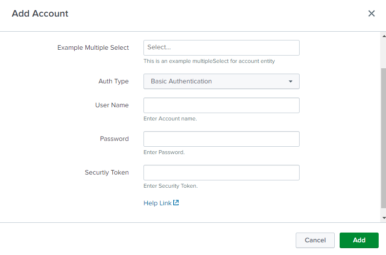

UCC allows you to add Auth support in the configuration page. In UCC, OAuth2.0 of the Authorization Code Flow `grant` type is used. It only supports the standard parameters specified in [RFCP749](https://www.rfc-editor.org/rfc/rfc6749) for obtaining an authorization code.

Auth can be used inside the entity tag. Use `type: "oauth"` in the entity list and specify the `options` next to the `type: "oauth"`.

### Properties

- `type` field value must be oauth.
- `options`:
    - `auth_type` must be present. It can have either ["basic", "oauth"] (If we want basic and oauth both support) or ["oauth"] (If we want oauth support only).
    - `basic` must be present only if the auth_type is ["basic"].
        - This will have a list of fields for you to add in the basic authentication flow. In the given example, it is username, password, and security_token. 
        - **Note: As of now, if you are selecting basic as auth_type, then the username and password fields are mandatory.**
    - `oauth` will have a list of fields for you to add in the oauth authentication flow. In the given example, it is `client_id`, `client_secret`, `redirect_url`, `scope`, and `endpoint`.
    - These fields are mandatory:
        - `client_id` is the client id for applying auth to your app or apps.
        - `client_secret` is the client secret for applying auth to your app or apps.
        - `redirect_url` will show the redirect url, which needs to be put in the app's redirect url.
        - `endpoint` will be the endpoint for you to build oauth support. For example, for salesforce, it will either  be "login.salesforce.com", "test.salesforce.com", or any other custom endpoint.
          - There is also the ability to specify separate endpoints for authorize and token. To do this, instead of the single 'endpoint' field, use two separate ones:
            - `endpoint_authorize` specifies the endpoint used for authorization, for example, login.salesforce.com.
            - `endpoint_token` specifies the endpoint used for the token acqusition, for example, api.login.salesforce.com.
    - `auth_code_endpoint` must be present and its value should be the endpoint value for getting the auth_code using the app. If the url to get the auth_code is https://login.salesforce.com/services/oauth2/authorize, then this will have the value /services/oauth2/authorize.
    - `access_token_endpoint` must be present and its value should be the endpoint value for getting the ccess_token using the auth_code received. If the url to get the access token is https://login.salesforce.com/services/oauth2/token, then it will have the value /services/oauth2/token.
    - `auth_label` allows the user to have the custom label for the Auth Type dropdown.
    - `oauth_popup_width` is the width in pixels of the pop-up window that will open for oauth authentication (Optional, defaults to 600).
    - `oauth_popup_height` is the height in pixels of the pop-up window that will open for oauth authentication (Optional, defaults to 600).
    - `oauth_timeout` is the timeout in seconds for oauth authentication (Optional, defaults to 180 seconds).
    - `oauth_state_enabled` is used to include the state for oauth authentication (default value is false). 
    - `auth_endpoint_token_access_type` is an optional parameter that is mapped into the value of the token_access_type query param in the authorisation url. 

    - The fields allowed in the basic and oauth fields are the following: 
        - `oauth_field` should be kept as it is and without any change.
        - `label` can be changed if the user wants to change the label of the field in UI.
        - `field` must keep it as it is for mandatory fields as mentioned before. 
        - `help` can be changed the if user wants to change the help text displayed below the field.
        - `encrypted` should be true if the user wants that particular field encrypted, otherwise, there is no need to have this parameter.
        - `required` specifies whether the field is required or not. The default value is true.
        - `defaultValue` is the initial input value (string, number, or boolean).
        - `options`:
            - `placeholder`: The placeholder for the field.
            - `disableonEdit`: When the form is in edit mode, the field becomes unable to be edited. The default value is false.
            - `enable`: The enable property sets whether a field is enabled or not. The default value is true.


> [!WARNING]
> The [Placeholder](https://splunkui.splunkeng.com/Packages/react-ui/Text?section=develop) attribute is deprecated and will be removed in one of the following versions. Instead, using the "help" attribute is recommended. 

### Usage

```
"configuration": {
    "title": "Configurations",
    "description": "Configure your servers and templates.",
    "tabs": [
        {
            "name": "account",
            "title": "Account",
            "entity": [
                {
                    "field": "name",
                    "label": "Name",
                    "type": "text",
                    "required": true,
                    "help": "Enter a unique name for each Crowdstrike falcon host account.",
                },
                {
                    "type": "oauth",
                    "field": "oauth",
                    "label": "Not used",
                    "options": {
                        "auth_type": [
                            "basic",
                            "oauth"
                        ],
                        "basic": [
                            {
                                "oauth_field": "username",
                                "label": "User Name",
                                "field": "username",
                                "help": "Enter Account name."
                            },
                            {
                                "oauth_field": "password",
                                "label": "Password",
                                "field": "password",
                                "encrypted": true,
                                "help": "Enter Password."
                            },
                            {
                                "oauth_field": "security_token",
                                "label": "Securtiy Token",
                                "field": "security_token",
                                "encrypted": true,
                                "help": "Enter Security Token."
                            }
                        ],
                        "oauth": [
                            {
                                "oauth_field": "client_id",
                                "label": "Client Id",
                                "field": "client_id",
                                "help": "Enter Client Id."
                            },
                            {
                                "oauth_field": "client_secret",
                                "label": "Client Secret",
                                "field": "client_secret",
                                "encrypted": true,
                                "help": "Enter Client Secret."
                            },
                            {
                                "oauth_field": "redirect_url",
                                "label": "Redirect url",
                                "field": "redirect_url",
                                "help": "Please add this redirect URL in your app."
                            },
                            {
                                "oauth_field": "scope",
                                "label": "Scope",
                                "field": "scope",
                                "help": "Enter the scope for the authorization code with ',' separating each scope.",
                                "required": false
                            },
                            {
                                "oauth_field": "endpoint",
                                "label": "Endpoint",
                                "field": "endpoint",
                                "help": "Enter Endpoint"
                            }
                        ],
                        "auth_label": "Auth Type",
                        "oauth_popup_width": 600,
                        "oauth_popup_height": 600,
                        "oauth_timeout": 180,
                        "auth_code_endpoint": "/services/oauth2/authorize",
                        "access_token_endpoint": "/services/oauth2/token",
                        "auth_endpoint_token_access_type": "offline"
                    }
                }
            ],
        }
    ]
}
```

### Output

This is how the Add Account modal looks after adding the above code to the globalConfig.json file:

This is how Add Account looks when the auth_type is `basic`:


This is how Add Account looks when the auth_type is `oauth`:

