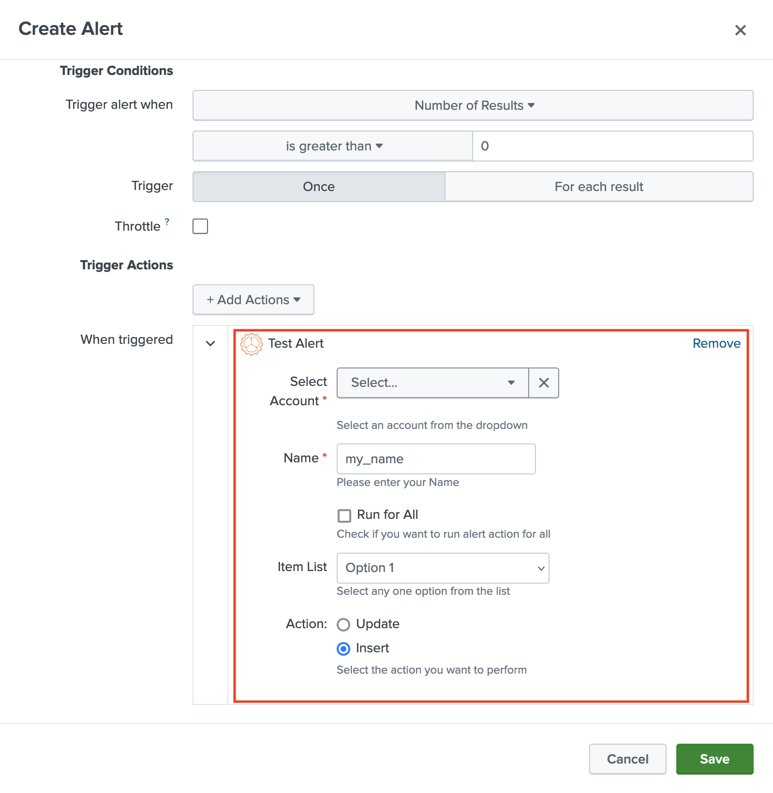

The alert action can help a user to take action on the alerts that have been triggered. The knowledge from Splunk can be sent to an outside service or to pull additional or detailed information related to the trigger details.
An add-on can have multiple alert actions based on the use cases the add-on provides. You can know more about alert actions from [this documentation](https://docs.splunk.com/Documentation/Splunk/latest/Alert/Aboutalerts).

Developers are required to add alerts in the global config file to create an Alert Action. All the alerts
(belonging to all the add-ons and apps) present on a Splunk instance would be shown in the "Trigger Actions" section when creating an alert.

### Properties

| Property                                                                  | Type   | Description                                                                                            |
|---------------------------------------------------------------------------|--------|--------------------------------------------------------------------------------------------------------|
| name<span class="required-asterisk">\*</span>                            | string | Alphanumeric name that would be used to generate the Python file for the alert action. |
| label<span class="required-asterisk">\*</span>                            | string | User-friendly name of the alert action that would be seen in the Trigger Actions. |
| entity<span class="required-asterisk">\*</span>                            | array | Array of inputs that would be available in the alert action. |
| iconFileName                            | string | The name of the icon to be shown in the Alert Action UI. It has to be present in `<YOUR_ADD-ON_NAME>/appserver/static/` directory. Default file name (and icon): `alerticon.png` that comes with UCC framework. |
| description<span class="required-asterisk">\*</span>                            | string | Description of the alert action. |
| activeResponse                            | object | Define only if the alert action will be visible for AR in Splunk Enterprise Security app. Note: <strong>DEPRECATED. Use `adaptiveResponse` instead.</strong> |
| adaptiveResponse                            | object | Define only if the alert action will be visible for AR in Splunk Enterprise Security app. Refer [this section](adaptive_response.md) for complete details. |
| customScript | string | A Python script that would have validation and logic for alert action execution. The script should be present at `<YOUR_ADD-ON_NAME>/bin/`. Refer [this section](alert_scripts.md#custom-script-for-alert-action) for more information. |

### Alert Properties

| Property                                                                  | Type   | Description                                                                                            |
|---------------------------------------------------------------------------|--------|--------------------------------------------------------------------------------------------------------|
| type<span class="required-asterisk">\*</span>                            | string | The type of the user input in the alert. Available choices: "text", "checkbox", "singleSelect", "radio", "singleSelectSplunkSearch". |
| label<span class="required-asterisk">\*</span>                            | string | The text that would be shown in the alert action UI. |
| field<span class="required-asterisk">\*</span>                            | string | The field that would be used in the scripts to get the value from the user input. These are defined as `param.<field_mentioned>` in the `alert_actions.conf`. |
| options                            | array | Static choices that a user can select in the alert action UI. |
| required                            | boolean | Whether the mentioned field is required or not. Default: false |
| help                            | string | Help text to be shown under the field of the alert. |
| search                            | string | A Splunk SPL that would query and return some result. Query the REST API, a lookup table, or indexed data. |
| valueField                            | string | Field name to use for drop-down option values that correspond to the option labels. In some cases, you can use the same results field for the label-field and value-field. In other cases, you might need to display human-readable labels from one field and use the corresponding values from another field. Note: Applicable when a `search` property is defined. |
| labelField                            | string | Field name to use for drop-down option labels. Labels generated from this field are visible in the drop-down interface. Note: Applicable when a `search` property is defined. |

### Usage

This is how the global configuration looks like for an alert action:

```json
"alerts": [
        {
            "name": "test_alert",
            "label": "Test Alert",
            "description": "Description for your Alert Action",
            "entity": [
                {
                    "type": "singleSelectSplunkSearch",
                    "label": "Select Account",
                    "field": "account",
                    "search": "| rest /servicesNS/nobody/Splunk_TA_UCCExample/splunk_ta_uccexample_account splunk_server=local | dedup title",
                    "options": {
                        "items": [
                            {
                                "label": "earliest",
                                "value": "-4@h"
                            },
                            {
                                "label": "latest",
                                "value": "now"
                            }
                        ]
                    },
                    "valueField": "title",
                    "labelField": "title",
                    "help": "Select an account from the dropdown",
                    "required": true
                },
                {
                    "type": "text",
                    "label": "Name",
                    "field": "name",
                    "defaultValue": "my_name",
                    "required": true,
                    "help": "Please enter your Name"
                },
                {
                    "type": "checkbox",
                    "label": "Run for All",
                    "field": "run_for_all",
                    "defaultValue": 0,
                    "required": false,
                    "help": "Check if you want to run alert action for all "
                },
                {
                    "type": "singleSelect",
                    "label": "Item List",
                    "field": "item_list",
                    "options": {
                        "items": [
                            {
                                "value": "option_1",
                                "label": "Option 1"
                            },
                            {
                                "value": "option_2",
                                "label": "Option 2"
                            }
                        ]
                    },
                    "help": "Select any one option from the list",
                    "required": false,
                    "defaultValue": "option_1"
                },
                {
                    "type": "radio",
                    "label": "Action:",
                    "field": "action",
                    "options": {
                        "items": [
                            {
                                "value": "update",
                                "label": "Update"
                            },
                            {
                                "value": "insert",
                                "label": "Insert"
                            }
                        ]
                    },
                    "help": "Select the action you want to perform",
                    "required": true,
                    "defaultValue": "insert"
                }
            ]
        }
    ]
```

### Output

This is how the alert action looks like in the UI:


Refer the [Alert Scripts](alert_scripts.md) section to know what all files are created and how they can be updated to achieve the use case of your add-on.
