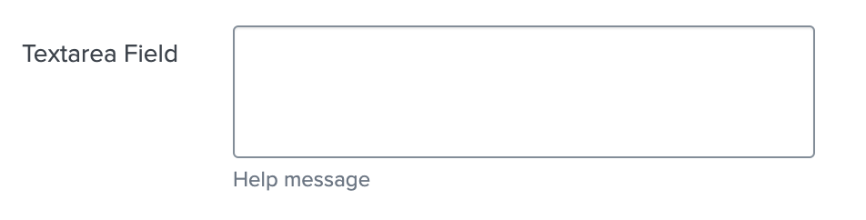

# Components supported by UCC

Components are used by UCC to render the Inputs and Configuration pages. Here is 
the list of the supported components. 

## `custom`

TBD

## `text`

TBD

## `textarea`

Underlying `@splunk/react-ui` component: [`TextArea`](https://splunkui.splunk.com/Packages/react-ui/TextArea).

`textarea` component is very similar to `text` component, but allows to have a 
multi-line input for text.

Example usage below:

```json
{
    "type": "textarea",
    "label": "Textarea Field",
    "field": "textarea_field",
    "help": "Help message",
    "options": {
        "rowsMin": 3,
        "rowsMax": 15
    },
    "required": true
}
```

This is how it looks like in the UI:



## `singleSelect`

TBD

## `checkbox`

TBD

## `multipleSelect`

TBD

## `radio`

TBD

## `placeholder`

TBD

## `oauth`

TBD

## `helpLink`

TBD

## `file`

Underlying `@splunk/react-ui` component: [`File`](https://splunkui.splunk.com/Packages/react-ui/File).

Define the file formats your add-on supports under `supportedFileTypes` key (it is required).
`maxFileSize` value will be considered in KB.

Usage example below:

```json
{
    "type": "file",
    "label": "SA certificate",
    "help": "Upload service account's certificate",
    "field": "service_account",
    "options": {
        "fileSupportMessage": "Support message",
        "supportedFileTypes": ["json", "pem"],
        "maxFileSize": 100
    },
    "encrypted": true,
    "required": true
}
```

This is how it looks like in the UI:


