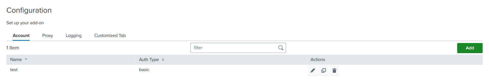

The `Configuration` tab can have multiple subtabs, for example, a tab for
account configuration (to configure the account by adding account credentials),
proxy configuration and logging level configuration.

### Configuration Properties

| Property                                                          | Type   | Description                                             |
|-------------------------------------------------------------------| ------ | ------------------------------------------------------- |
| title<span class="required-asterisk">\*</span>                    | string | -                                                       |
| description                                                       | string | To provide a brief summary of an configuration page.    |
| [subDescription](../advanced/sub_description)                     | object | To provide broader description of an configuration page |
| [tabs](#tabs-properties)<span class="required-asterisk">\*</span> | array  | To specify a list of tab.                               |

### Tabs properties

| Property                                                     | Type   | Description                                                                                                                                                                                        |
|--------------------------------------------------------------| ------ | -------------------------------------------------------------------------------------------------------------------------------------------------------------------------------------------------- |
| name<span class="required-asterisk">\*</span>                | string | To define the particular tab name.                                                                                                                                                                 |
| title<span class="required-asterisk">\*</span>               | string | To show the title of the tab.                                                                                                                                                                      |
| [entity](../entity)<span class="required-asterisk">\*</span> | array  | A list of fields and their properties.                                                                                                                                                             |
| [table](../table)                                            | object | To display accounts stanza in table                                                                                                                                                                |
| style                                                        | string | By specifying this property in the global config file, the forms can either be opened as a new page or in a dialog. <br>Supported values are "page" or "dialog". <br> Default value is **dialog**. |
| options                                                      | object | This property allows you to enable the [saveValidator](../advanced/save_validator) feature.                                                                                                        |
| hook                                                         | object | It is used to add custom behaviour to forms. Visit the [Custom Hook](../custom_ui_extensions/custom_hook) page to learn more.                                                                      |
| [warning](../advanced/custom_warning.md)                     | object | It is used to add custom warning message for each of modes ('create', 'edit', 'config', 'clone'), message is displayed on form                                                                     |
| conf                                                         | string | TBD                                                                                                                                                                                                |
| restHandlerName                                              | string | TBD                                                                                                                                                                                                |
| restHandlerModule                                            | string | TBD                                                                                                                                                                                                |
| restHandlerClass                                             | string | TBD                                                                                                                                                                                                |
| customTab                                                    | Object | This property allows you to enable the [custom tab](../custom_ui_extensions/custom_tab) feature.                                                                                                   |

### Usage

```json
"configuration": {
    "title": "Configuration",
    "description": "Set up your add-on",
    "tabs": [
        {
            "name": "account",
            "title": "Account",
            "table": {},
            "entity": []
        },
        {
            "name": "proxy",
            "title": "Proxy",
            "entity": [],
            "options": {
                "saveValidator": ""
            }
        }
    ]
}
```

Note: The example above creates a Configuration page with two **empty** tabs: Account and Proxy.
Specify your properties in `"table"` and `"entity"`.

### Output

This is how table looks in the UI:



This is how form looks in the UI:


More information about how to set Proxy tab, can be found [here](./proxy.md).
