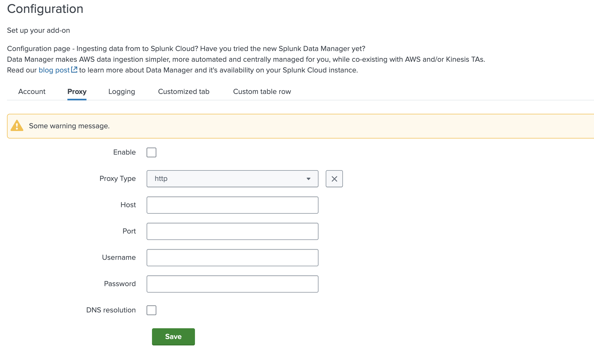

# Configuration

The `Configuration` tab can have multiple subtabs, for example, a tab for
account configuration (to configure the account by adding account credentials),
proxy configuration, and logging level configuration.

### Configuration Properties

| Property                                                          | Type   | Description                                             |
| ----------------------------------------------------------------- | ------ | ------------------------------------------------------- |
| title<span class="required-asterisk">\*</span>                    | string | -                                                       |
| description                                                       | string | To provide a brief summary of an configuration page.    |
| [subDescription](../advanced/sub_description.md)                  | object | To provide broader description of an configuration page |
| [tabs](#tabs-properties)<span class="required-asterisk">\*</span> | array  | To specify a list of tab.                               |
| capabilities | object | Specifies the capabilities required for the given methods. The provided capabilities will be generated in restmap.conf. For more information, refer to the Splunk documentation on [restmap.conf](https://docs.splunk.com/Documentation/Splunk/9.4.2/Admin/restmapconf#restmap.conf.spec).|

### Tabs properties

| Property                                                              | Type   | Description                                                                                                                                                                                                                                                                         |
| --------------------------------------------------------------------- | ------ | ----------------------------------------------------------------------------------------------------------------------------------------------------------------------------------------------------------------------------------------------------------------------------------- |
| name<span class="required-asterisk">\*</span>                         | string | To define the particular tab name.                                                                                                                                                                                                                                                  |
| title<span class="required-asterisk">\*</span>                        | string | To show the title of the tab.                                                                                                                                                                                                                                                       |
| [entity](../entity/index.md)<span class="required-asterisk">\*</span> | array  | A list of fields and their properties.                                                                                                                                                                                                                                              |
| [groups](../advanced/groups_feature.md)                               | array  | It is used to divide forms into distinct sections, each comprising relevant fields.                                                                                                                                                                                                 |
| [table](../table.md)                                                  | object | To display accounts stanza in table                                                                                                                                                                                                                                                 |
| style                                                                 | string | By specifying this property in the global config file, the forms can either be opened as a new page or in a dialog. <br>Supported values are "page" or "dialog". <br> Default value is **dialog**.                                                                                  |
| options                                                               | object | This property allows you to enable the [saveValidator](../advanced/save_validator.md) feature.                                                                                                                                                                                      |
| hook                                                                  | object | It is used to add custom behaviour to forms. Visit the [Custom Hook](../custom_ui_extensions/standard/custom_hook.md) page to learn more.                                                                                                                                                    |
| [warning](../advanced/custom_warning.md)                              | object | It is used to add custom warning message for each of modes ('create', 'edit', 'config', 'clone'), message is displayed on form                                                                                                                                                      |
| conf                                                                  | string | Configuration name for a rest handler.                                                                                                                                                                                                                                              |
| restHandlerName                                                       | string | It specify name of the REST handler script, that provides fields, models and validators for the fields supported under the specified input and any specific actions to be performed on CRUD operations for the given input. (Do NOT use with restHandlerModule or restHandlerClass) |
| [restHandlerModule](../advanced/custom_rest_handler.md)               | string | It specify name of the REST handler script that implements the custom actions to be performed on CRUD operations for the given input. (Use with restHandlerClass)                                                                                                                   |
| [restHandlerClass](../advanced/custom_rest_handler.md)                | string | It specify name of the class present in the restHandlerModule, which implements methods like handleCreate, handleEdit, handleList, handleDelete and is child class of splunktaucclib.rest_handler.admin_external.AdminExternalHandler. (Use with restHandlerModule)                 |
| customTab                                                             | Object | This property allows you to enable the [custom tab](../custom_ui_extensions/standard/custom_tab.md) feature.                                                                                                                                                                                 |
| hideForPlatform                                                       | string | Defines for which platform element should be hidden from UI perspective. Currently only two platforms are supported `cloud` or `enterprise`.                                                                                                                                        |
| formTitle                                                             | string | When provided, the `formTitle` parameter will override the default modal title format of `"Add selectedTab"`. The modal will display `Add` followed by the value of formTitle, allowing for a custom, context-specific title. This customization also applies to modals for `Clone`, `Edit`, and `Delete` actions.                                                                                                                                     |

### Tab components

Instead of specifying a tab from scratch with above fields, you can add a predefined
tab.

Currently available tab components:

- [Logging tab](./logging.md)
- [Proxy tab](./proxy.md)

### Usage

```json
"configuration": {
    "title": "Configuration",
    "description": "Set up your add-on",
    "tabs": [
        {
            "name": "account",
            "title": "Account",
            "table": {},
            "entity": []
        },
        {
            "type": "proxyTab",
             "warning": {
                "config": {
                    "message": "Some warning message"
                }
            },
            "proxy_type": true,
            "username": true,
            "password": true,
            "dns_resolution": true
        },
        {
            "type": "loggingTab"
        }
    ],
    "capabilities": {
        "put": "admin_all_objects",
        "post": "list_storage_passwords"
    }
}
```

Note: The example above creates a Configuration page with an **empty** Account tab.
Specify your properties in `"table"` and `"entity"`.

### Output

This is how table looks in the UI:


This is how Proxy tab looks in the UI:



More information about how to set Proxy tab, can be found [here](./proxy.md).

This is how custom header look in the UI:

<iframe src="/addonfactory-ucc-generator/storybook/?path=/story/pages-configurationpage--configuration-custom-header&full=1&shortcuts=false&singleStory=true"></iframe>
