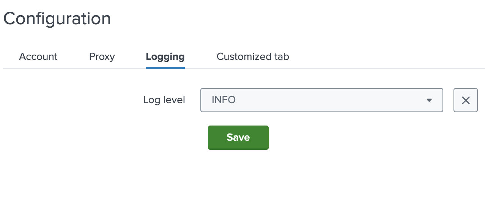

The logging tab is a predefined component that allows to create the page for changing
the log level. It is added in the `pages.configuration.tabs` array



### Minimal definition

```json
{
  "type": "loggingTab"
}
```

This creates the tab seen in the image above with log levels:
DEBUG, INFO, WARNING, ERROR, CRITICAL. INFO is the default level.
The value is saved in `loglevel` config parameter.

### Usage

It is placed just like every other configuration tab.

```json
{
    "pages": {
        "configuration": {
            "tabs": [
              {
                "type": "loggingTab"
              }
            ],
            "title": "Configuration",
            "description": "..."
        }
    }
}
```

### Optional Fields

| Field Name   | Description                                                                                     |
|--------------|-------------------------------------------------------------------------------------------------|
| name         | Tab name. Default is `logging`                                                                  |
| title        | Tab title. Default is `Logging`                                                                 |
| label        | Label text displayed next to the log level dropdown. Default is `Log level`                     |
| field        | Configuration field name. Default is `loglevel`                                                 |
| levels       | List of all possible log levels. Default is `["DEBUG", "INFO", "WARNING", "ERROR", "CRITICAL"]` |
| defaultLevel | Default log level at the beginning. Default is `INFO`                                           |
| help         | It is displayed directly below the input field. By default it is not shown.                     |

### Example

```json
{
    "type": "loggingTab",
    "name": "logging_other",
    "title": "Logging other",
    "label": "Log level",
    "field": "loglevel",
    "levels": ["DEBUG", "INFO", "WARNING", "ERROR", "CRITICAL"],
    "defaultLevel": "INFO",
    "help": "The logging level you want to use"
}
```

