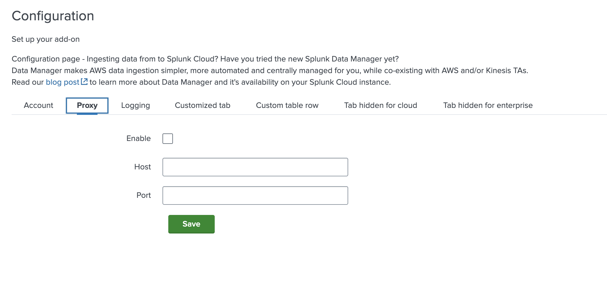
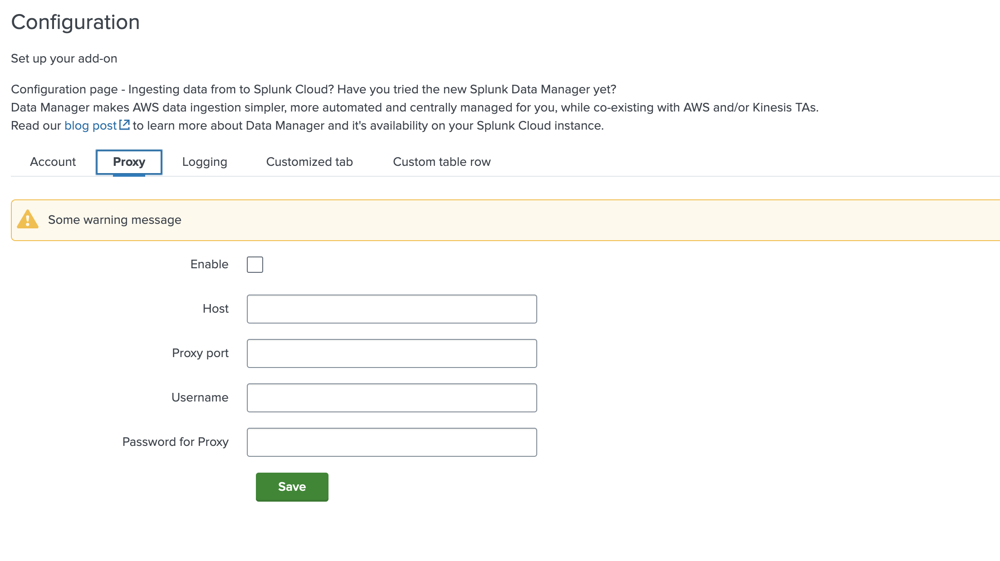

# Proxy

The Proxy tab is a predefined component that allows to create a proxy tab with default configurations. It is added in the `pages.configuration.tabs` array




### Minimal definition

```json
{
  "type": "proxyTab"
}
```

This creates the tab seen in the image above with 3 default entities that are `Enable` (checkbox for enabling proxy), `Host` (proxy host) and `Port` (proxy port).

### Available configurations

Below are the available properties that can be used while configuring `proxy`. Properties like `name`, `title`, `enable proxy`, `host` and `port` are auto generated (if [minimal defination](#minimal-definition) of proxy is provided).

- Name (auto generated):

```
proxy
```

- Title (auto generated):

```
Proxy
```

- Enable proxy (auto generated) :

```json
{
    "type": "checkbox", 
    "label": "Enable",
    "field": "proxy_enabled"
}
```

- Proxy type :

```json
{
    "type": "singleSelect",
    "label": "Proxy Type",
    "required": false,
    "options": {
        "disableSearch": true,
        "autoCompleteFields": [
            {"value": "http", "label": "http"},
            {"value": "socks4", "label": "socks4"},
            {"value": "socks5", "label": "socks5"},
        ],
    },
    "defaultValue": "http",
    "field": "proxy_type",
}
```

- Host (auto generated) :

```json
{
    "type": "text",
    "label": "Host",
    "validators": [
        {
            "type": "string",
            "errorMsg": "Max host length is 4096",
            "minLength": 0,
            "maxLength": 4096,
        },
        {
            "type": "regex",
            "errorMsg": "Proxy Host should not have special characters",
            "pattern": "^[a-zA-Z]\\w*$",
        },
    ],
    "field": "proxy_url",
}
```

- Port (auto generated) :

```json
{
    "type": "text",
    "label": "Port",
    "validators": [{"type": "number", "range": [1, 65535], "isInteger": true}],
    "field": "proxy_port",
}
```

- Username :

```json
{
    "type": "text",
    "label": "Username",
    "validators": [
        {
            "type": "string",
            "errorMsg": "Max length of username is 50",
            "minLength": 0,
            "maxLength": 50,
        }
    ],
    "field": "proxy_username",
}
```

- Password :

```json
{
    "type": "text",
    "label": "Password",
    "validators": [
        {
            "type": "string",
            "errorMsg": "Max length of password is 8192",
            "minLength": 0,
            "maxLength": 8192,
        }
    ],
    "encrypted": true,
    "field": "proxy_password",
}
```

- DNS Resolution checkbox :

```json
{
    "type": "checkbox",
    "label": "DNS resolution",
    "field": "proxy_rdns",
}
```


When only `"type": "proxyTab"` is specified in the globalConfig file, the following entities will be generated by default `host`, `port`, `enable proxy`.

Entities such as `proxy_type`, `username`, `password`, and `dns_resolution` will not be included by default.
To include these optional entities in your add-on, you must explicitly set them to `True` in your configuration. For details on available configurations, refer to the [available configurations](#available-configurations) section.

### Usage

It is placed just like every other configuration tab.

```json
{
    "pages": {
        "configuration": {
            "tabs": [
              {
                "type": "proxyTab"
              }
            ],
            "title": "Configuration",
            "description": "..."
        }
    }
}
```

To customize these default configurations, you can define them in JSON format by specifying certain keys unique to each entity (refer the [keys section](#keys) for details on the required keys for each entity). When creating the JSON, you only need to include the values you want to customize. For example, if you don’t need to modify fields like `lable` or `field`, you can skip including them in your globalConfig.  For better understanding, refer to the provided [Example](#example) which demonstrates how to apply customizations effectively.

> **_NOTE:_**
    There are 2 ways to exclude optional entities in your add-on, either omit them from the proxy tab, or set the entities to false.

### Keys

| Key Name     | Description                                                        |
|----------------|--------------------------------------------------------------------|
| name  | Name of the proxy                                  |
| title  | Title of proxy tab                                  |
| enable_proxy  | Whether proxy should be enabled                                   |
| proxy_type     | Type of Proxy communication protocols supported. Default: `SOCKS4`, `SOCKS5`, `HTTP` |
| host      | Hostname (FQDN, IPv6 or IPv4) of the Proxy server |
| port     | Port of the Proxy server that accepts the connection |
| username | Username used to authenticate the access to Proxy Server |
| password | Password for the provided username to authenticate access to Proxy Server |
| dns_resolution     | Whether DNS resolution should be done by Proxy server or not |


### Example

```json
{
   "type": "proxyTab",
   "name": "custom_proxy",
   "warning": {
        "config": {
        "message": "Some warning message"
        }
    },
   "port": {
       "label": "Proxy port",
       "validator": [
           {
               "type": "number",
               "range": [
                   1025,
                   65535
               ],
               "isInteger": true
           }
       ]
   },
   "username": true,
   "password": {
       "label": "Password for Proxy"
   },
   "dns_resolution": false,
}
```

The above will get converted to the older definition (mentioned below) in your output directory.



```json
{
--8<-- "tests/unit/tabs/test_proxy_tab.py:9:69"
}
```
