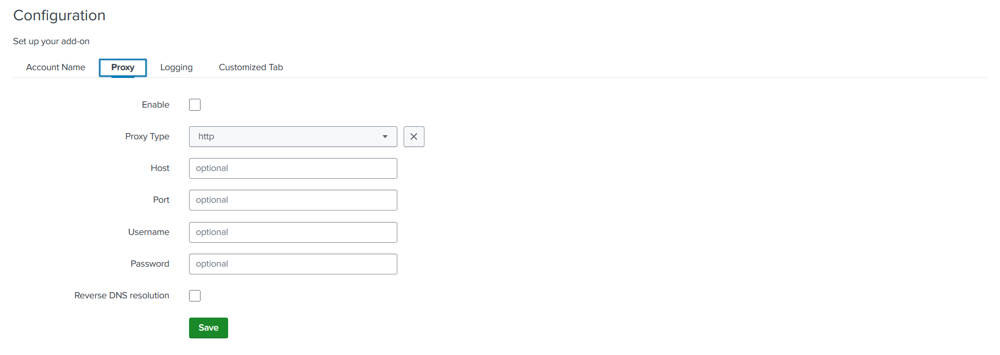

There are fields that need to be specified in order to enable proxy.

### Fields

| Field Name     | Description                                                        |
|----------------|--------------------------------------------------------------------|
| proxy_enabled  | Whether proxy should be enabled.                                   |
| proxy_type     | Proxy type. Available values: http, http_no_tunnel, socks4, socks5 |
| proxy_url      | Host                                                               |
| proxy_port     | Port                                                               |
| proxy_username | Username used to access the proxy server                           |
| proxy_password | Password assigned for that username                                |
| proxy_rdns     | Whether reverse DNS resolution should be used                      |

### Example Tab

```json
{
    "name": "proxy",
    "title": "Proxy",
    "entity": [
        {
            "type": "checkbox",
            "label": "Enable",
            "field": "proxy_enabled"
        },
        {
            "type": "singleSelect",
            "label": "Proxy Type",
            "options": {
                "disableSearch": true,
                "autoCompleteFields": [
                    {
                        "value": "http",
                        "label": "http"
                    },
                    {
                        "value": "socks4",
                        "label": "socks4"
                    },
                    {
                        "value": "socks5",
                        "label": "socks5"
                    }
                ]
            },
            "defaultValue": "http",
            "field": "proxy_type"
        },
        {
            "type": "text",
            "label": "Host",
            "validators": [
                {
                    "type": "string",
                    "errorMsg": "Max host length is 4096",
                    "minLength": 0,
                    "maxLength": 4096
                }
            ],
            "field": "proxy_url"
        },
        {
            "type": "text",
            "label": "Port",
            "validators": [
                {
                    "type": "number",
                    "range": [
                        1,
                        65535
                    ]
                }
            ],
            "field": "proxy_port"
        },
        {
            "type": "text",
            "label": "Username",
            "validators": [
                {
                    "type": "string",
                    "errorMsg": "Max length of username is 50",
                    "minLength": 0,
                    "maxLength": 50
                }
            ],
            "field": "proxy_username"
        },
        {
            "type": "text",
            "label": "Password",
            "validators": [
                {
                    "type": "string",
                    "errorMsg": "Max length of password is 8192",
                    "minLength": 0,
                    "maxLength": 8192
                }
            ],
            "encrypted": true,
            "field": "proxy_password"
        },
        {
            "type": "checkbox",
            "label": "Reverse DNS resolution",
            "field": "proxy_rdns"
        }
    ],
    "options": {
        "saveValidator": "function(formData) { if(!formData.proxy_enabled || formData.proxy_enabled === '0') {return true; } if(!formData.proxy_url) { return 'Proxy Host can not be empty'; } if(!formData.proxy_port) { return 'Proxy Port can not be empty'; } return true; }"
    }
}
```

The example above creates the following form:



