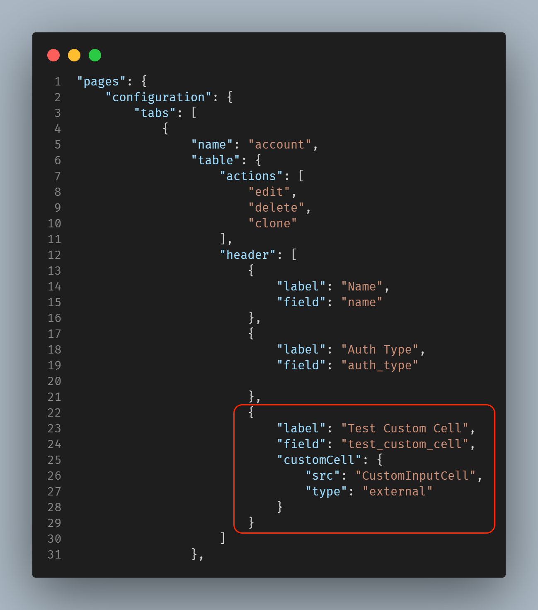
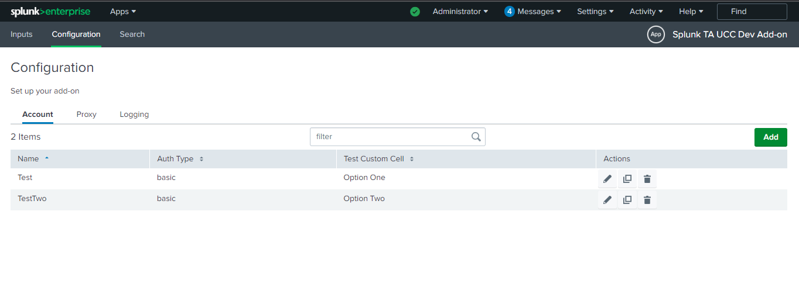

Custom Cell is used when the content of a table cell needs to be updated.
We can use Custom Cell inside the table header in the inputs and configuration page.

Here is how you specify a custom cell hook:
```
"customCell": {
  "src": "custom_cell",
  "type": "external"
}
```
The custom_cell file's relative path to globalConfig file is `appserver/static/js/build/custom/custom_cell.js`

### Usage

Use Custom Cell in the configuration table:


### Properties

| Property          | Description |
| ----------------- | ----------- |
| globalConfig      | It is an hierarchical object having the properties and their values same as the globalConfig file. |
| el                | The html element of the custom cell. |
| serviceName       | The name of the service/tab specified in the globalConfig file. |
| row               | The object of the record for which the CustomRowInput constructor is called. |
| field             | The name of the field as specified in the globalConfig file. |

### Methods

| Property          | Description |
| ----------------- | ----------- |
| Render            | This method should contain the rendering logic for the custom component. This method is called when the create, edit or clone form is rendered. |

### Example

```
class CustomInputCell {
    /**
     * Custom Row Cell
     * @constructor
     * @param {Object} globalConfig - Global configuration.
     * @param {string} serviceName - Input service name.
     * @param {element} el - The element of the custom cell.
     * @param {Object} row - custom row object.
     * @param {string} field - The cell field name.
     */
    constructor(globalConfig, serviceName, el, row, field) {
        this.globalConfig = globalConfig;
        this.serviceName = serviceName;
        this.el = el;
        this.row = row;
        this.field = field;
    }
    render() {
        let html = "";
        // Check for missing configuration in account
        if (this.row.account_multiple_select === "one") {
            html = "Option One";
        } else if(this.row.account_multiple_select === "two"){
            html = "Option Two";
        } else {
            html = "Option is not available"
       }
        this.el.innerHTML = html;
        return this;
    }
}
export default CustomInputCell; 
```

### Output

This is how custom cell looks:

