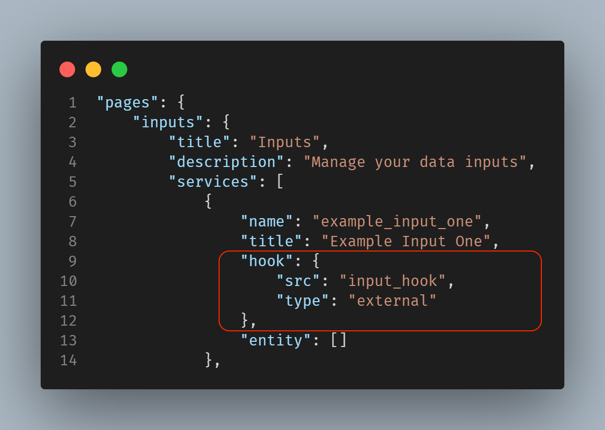
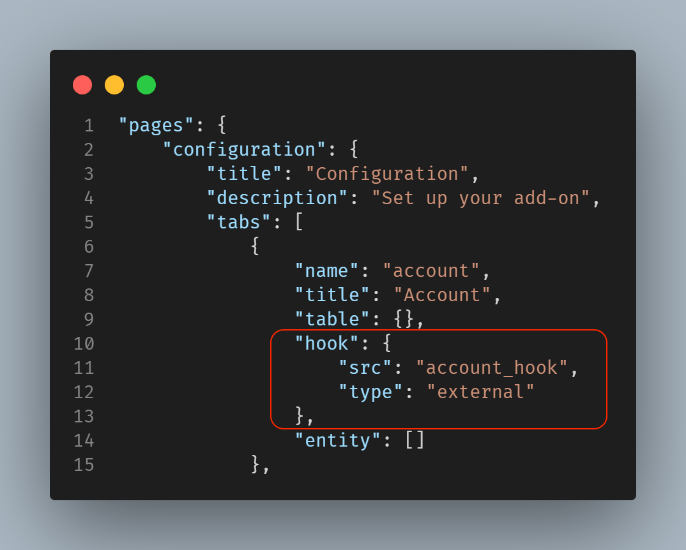

Custom Hook is a JavaScript function that allows us to reuse some code throughout the app. It is used to validate form/dialog inputs.

Hook is nothing more than Javascript event handling on the events `onCreate`, `onChange`, `onRender`, `onSave`, `onSaveSuccess`, `onSaveFail` and `onEditLoad`.

Hooks can be used inside the services and tabs placed next to the entity tag. 

The configuration and code for adding a hook to an entity are shown below. 

```
"hook": {
  "src": "custom_hook",
  "type": "external"
}
```
The type key needs to be set as external to webpack the custom extensions. UCC  expects scripts marked as external to follow the ESM syntax for exporting and importing modules. Any other value or not specifying type will default to old requireJS (AMD) import syntax. Aditionally, the custom javascript file and the imported modules will not get webpack-ed.

The custom_hook file's relative path to globalConfig.json is `appserver/static/js/build/custom/custom_hook.js`

### Example:

Use hook in the services:


Use hook in the tabs:


### Properties of the Hook class:

| Property          | Description |
| ----------------- | ----------- |
| globalConfig      | It is an hierarchical object having the properties and their values same as the globalConfig.json file. |
| serviceName       | The name of the service/tab specified in the globalConfig.json. |
| state             | State is an object that represents the actual state value of the components in the service/tab when the hook's constructor is called. Updating this object will not update the state of the page. Use the `util.setState` method to update the page's state. |
| mode              | Text |
| util              | This is a utility object with various functions that can be used to manipulate the page UI. There are 4 methods associated : <ul><li>`clearAllErrorMsg`: ƒ (State)</li><li>`setErrorFieldMsg`: ƒ (field, msg)</li><li>`setErrorMsg`: ƒ (msg)</li><li>`setState`: ƒ setState(callback)</li></ul>|

### Methods of the Hook class:
We can use these methods to overirde existing methods according to the functionality desired:

| Property          | Description |
| ----------------- | ----------- |
| onCreate      | This method is called when we click on the "Add/Create" button for creating a new record on the page. |
| debounce       | This method is used to create another special method which does not get executed on every call. This functionality can be useful when listening for an event. <p>For Example, we only want to show help text/error when the user has stopped typing for 500ms in a text-box and not on every key press.  In this scenario, the debounce method will induce a time wait every time a key is pressed and the method will only execute when there is no other call to it within that time wait.</p> |
| onChange             | This method is called when the value of any field is changed. |
| onRender              | This method is called once whenever the user clicks on a "Add", "Edit" or "Clone" button. |
| onSave              | This method is called when the user clicks the "Save" button after creating, editing or cloning a record. |
| onSaveSuccess              | This method is called when a record has been successfully saved. |
| onSaveFail              | This method is called when a record fails to save due to any error. |
| onEditLoad              | This method is called when the user clicks on a "Edit" button for an existing record. |


### Custom Hook Example:

```
import _ from "underscore"; // example of a ESM import

class Hook {
    /**
     * Form hook
     * @constructor
     * @param {Object} globalConfig - Global configuration.
     * @param {string} serviceName - Service name
     * @param {object} state - object with state of the components on the servcice/page
     * @param {string} mode - edit,create or clone
     * @param {object} util - the utility object
     */
    constructor(globalConfig, serviceName, state, mode, util) {
        this.globalConfig = globalConfig;
        this.serviceName = serviceName;
        this.state = state;
        this.mode = mode;
        this.util = util;
        this._debouncedNameChange = this.debounce(this._nameChange.bind(this), 200);
        console.log('Inside Hook mode: ', mode);
    }

    onCreate() {
        if (this.mode == "create") {
            console.log('in Hook: onCreate');
        }
    }

    debounce(func, wait) {
        let timeout;
        // This is the function that is returned and will be executed many times
        // We spread (...args) to capture any number of parameters we want to pass
        return function executedFunction(...args) {
            // The callback function to be executed after
            // the debounce time has elapsed
            // This will reset the waiting every function execution.
            // This is the step that prevents the function from
            // being executed because it will never reach the
            // inside of the previous setTimeout
            clearTimeout(timeout);

            // Restart the debounce waiting period.
            // setTimeout returns a truthy value
            timeout = setTimeout(() => {func(...args)}, wait);
        }
    }
    
    onChange(field, value, dataDict) {
        console.log('in Hook: onChange ', field, ' value : ', value);
        console.log('in Hook: onChange state: ', this.state);
        if (field === "name") {
          this._debouncedNameChange(dataDict)
        }
    }

    onRender() {
        console.log('in Hook: onRender');
    }

    /* 
        Put form validation logic here.
        Return ture if validation pass, false otherwise.
        Call displayErrorMsg when validtion failed.
    */
    onSave(dataDict) {
        console.log('in Hook: onSave with data: ', dataDict);
        var accountname = dataDict.name;
        var auth_type = dataDict.auth_type;
        var endpoint = dataDict.url;
        
        this.util.setState((prevState) => {
            /*
            Example usage of util.clearAllErrorMsg. It just returns the modified state object after clearing the error messages.
            It won't update the UI.
            */
            let new_state = this.util.clearAllErrorMsg(prevState);
            return new_state
        });

        if (accountname === null || accountname.trim().length === 0) {
            var msg = "Field account name is required";
            this.util.setErrorMsg(msg);
            return false;
        } else if (endpoint === null || endpoint.trim().length === 0) {
            var msg = "Field URL is required";
            this.util.setErrorMsg(msg);
            return false;
        } else if (endpoint.indexOf("https://") !== 0) {
            var msg =
            "URL should start with 'https://' as only secure URLs are supported.";
            this.util.setErrorFieldMsg("url", msg);
            return false;
        } else if (auth_type == "oauth") {
            endpoint = endpoint.replace("https://", ""); //removing the https schema from the endpoint
            this.util.setState((prevState) => {
            let data = { ...prevState.data };
            data.endpoint.value = endpoint;
            return { data };
            });
        }
        return true;
    }

    onSaveSuccess() {
        console.log('in Hook: onSaveSuccess');
    }

    onSaveFail() {
        console.log('in Hook: onSaveFail');
    }

    /*
    Put logic here to execute javascript after loading edit UI.
    */
    onEditLoad() {
        console.log('in Hook: onEditLoad');
    }

    _nameChange(dataDict) {
        console.log('in Hook: _nameChange');            
    }
}

export default Hook;
```
