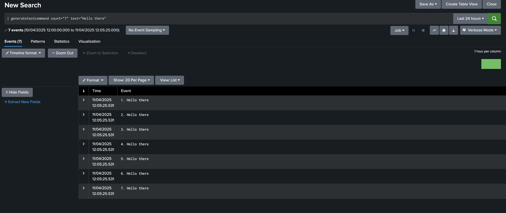

# Custom Search Command

Custom search commands are user-defined [SPL](https://docs.splunk.com/Splexicon:SPL) (Splunk Search Processing Language) commands that enable users to add custom functionality to their Splunk searches.

There are 4 types of Custom search commands:

- Generating
- Streaming
- Transforming
- Dataset processing

> Note: Currently UCC supports only three types of custom search command, that are `Generating`, `Streaming` and `Dataset processing`.

> Note: Eventing commands are being referred as Dataset processing commands [reference](https://dev.splunk.com/enterprise/docs/devtools/customsearchcommands/).

## Generation of custom search command

A new tag has been introduced in globalConfig (same indent level as of `meta` tag) named `customSearchCommand` where you need to define the configuration for the custom search command.

### Minimal definition

```json
"customSearchCommand": [
    {
        "commandName": "mycommandname",
        "fileName": "mycommandlogic.py",
        "commandType": "generating",
        "arguments": [
            {
                "name": "argument_name",
                "validate": {
                    "type": "Fieldname"
                },
                "required": true
            },
            {
                "name": "argument_two"
            }
        ]
    }
]
```

This configuration will generate a template Python file named `mycommandname.py`, which imports logic from the `mycommandlogic.py` file and automatically updates the `commands.conf` file as shown below:

```
[mycommandname]
filename = mycommandname.py
chunked = true
python.version = python3
```

 **NOTE:**
   If the file specified in the `fileName` field does not exist in the `<YOUR_ADDON/bin>` directory, the build will fail.

### Attributes for `customSearchCommand` tag

| Property                 | Type   | Description |
| ------------------------ | ------ | ------------------------------------ |
| commandName<span class="required-asterisk">\*</span>  | string  | Name of the custom search command |
| fileName<span class="required-asterisk">\*</span>     | string  | Name of the Python file which contains logic of custom search command  |
| commandType<span class="required-asterisk">\*</span>  | string  | Specify type of custom search command. Three types of commands are allowed, `streaming`,`generating` and `dataset processing`. |
| arguments<span class="required-asterisk">\*</span>    | array[objects]  | Arguments which can be passed to custom search command. |
| requiredSearchAssistant                               | boolean | Specifies whether search assistance is required for the custom search command. Default: false. |
| usage                                                 | string  | Defines the usage of custom search command. It can be one of `public`, `private` and `deprecated`.  |
| description                                           | string  | Provide description of the custom search command.   |
| syntax                                                | string  | Provide syntax for custom search command   |

To generate a custom search command, the following attributes must be defined in globalConfig: `commandName`, `commandType`, `fileName`, and `arguments`. Based on the provided commandType, UCC will generate a template Python file and integrate the user-defined logic into it.

If `requiredSearchAssistant` is set to True, the `syntax`, `description`, and `usage` attributes are mandatory, as they are essential for generating `searchbnf.conf` file.

**NOTE:**
    The user-defined Python file must include specific functions based on the command type:

- For `Generating` command, the Python file must include a `generate` function.
- For `Streaming` command, the Python file must include a `stream` function.
- For `Dataset processing` command, the Python file must include a `transform` function.

## Arguments

| Property                                                              | Type   | Description   |
| --------------------------------------------------------------------- | ------ | ------------------------------------------------------- |
| name<span class="required-asterisk">\*</span>                         | string | Name of the argument  |
| defaultValue                                                          | string/number | Default value of the argument.  |
| required                                                              | boolean |  Specify if the argument is required or not. |
| validate                                                              | object | Specify validation for the argument. It can be any of `Integer`, `Float`, `Boolean`, `RegularExpression` or `FieldName`. |

UCC currently supports five types of validations provided by `splunklib` library:

- IntegerValidator
    + you can optionally define `minimum` and `maximum` properties.
- FloatValidator
    + you can optionally define `minimum` and `maximum` properties.
- BooleanValidator
    + no additional properties required.
- RegularExpressionValidator
    + no additional properties required.
- FieldnameValidator
    + no additional properties required.

For more information, refer [splunklib API docs](https://splunk-python-sdk.readthedocs.io/en/latest/searchcommands.html)

For example:

```json
"arguments": [
    {
        "name": "count",
        "required": true,
        "validate": {
            "type": "Integer",
            "minimum": 1,
            "maximum": 10
        },
        "default": 5
    },
    {
        "name": "test",
        "required": true,
        "validate": {
            "type": "Fieldname"
        }
    },
    {
        "name": "percent",
        "validate": {
            "type": "Float",
            "minimum": "85.5"
        }

    }
]

```

## Example

``` json
{
    "meta": {...}
    "customSearchCommand": [
        {
            "commandName": "generatetextcommand",
            "fileName": "generatetext.py",
            "commandType": "generating",
            "requiredSearchAssistant": true,
            "description": "This command generates COUNT occurrences of a TEXT string.",
            "syntax": "generatetextcommand count=<event_count> text=<string>",
            "usage": "public",
            "arguments": [
                {
                    "name": "count",
                    "required": true,
                    "validate": {
                        "type": "Integer",
                        "minimum": 5,
                        "maximum": 10
                    }
                },
                {
                    "name": "text",
                    "required": true
                }
            ]
        },
    ],
    "pages": {...}
}
```

Generated python file named `generatetextcommand.py`:

``` python
import sys
import import_declare_test

from splunklib.searchcommands import \
    dispatch, GeneratingCommand, Configuration, Option, validators
from generatetext import generate

@Configuration()
class GeneratetextcommandCommand(GeneratingCommand):
    """

    ##Syntax
    generatetextcommand count=<event_count> text=<string>

    ##Description
    This command generates COUNT occurrences of a TEXT string.

    """
    count = Option(name='count', require=True, validate=validators.Integer(minimum=5, maximum=10))
    text = Option(name='text', require=True)

    def generate(self):
       return generate(self)

dispatch(GeneratetextcommandCommand, sys.argv, sys.stdin, sys.stdout, __name__)
```

Generated stanza in `commands.conf` file

```
[generatetextcommand]
filename = generatetextcommand.py
chunked = true
python.version = python3
```

Generated stanza in `searchbnf.conf` file

```
[generatetextcommand]
syntax = generatetextcommand count=<event_count> text=<string>
description = This command generates COUNT occurrences of a TEXT string.
usage = public
```

### Output

This is how search result looks like:


