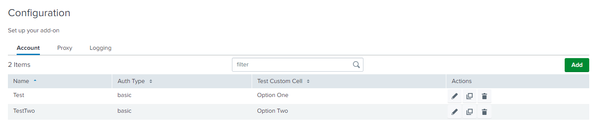

A Custom Cell is used to update the content of a table cell. 

`customCell` attribute will be used in the table header on the inputs and configuration page.

### Properties

| Property          | Description |
| ----------------- | ----------- |
| globalConfig      | It is a hierarchical object that contains the globalConfig file's properties and values. |
| el                | The html element of the custom cell. |
| serviceName       | The name of the service/tab specified in the globalConfig file. |
| row               | The object of the record for which the CustomRowInput constructor is called. |
| field             | The name of the field as specified in the globalConfig file. |

### Methods

| Property          | Description |
| ----------------- | ----------- |
| Render            | This method should contain the rendering logic for the custom component. This method is called when the create, edit, or clone form is rendered. |

### Usage

```
{
    "name": "account",
    "title": "Account"
    "entity": [],
    "table": {
        "actions": ["edit", "delete", "clone"],
        "header": [{
            "label": "Name",
            "field": "name"
        }, {
            "label": "Auth Type",
            "field": "auth_type"
        }, {
            "label": "Test Custom Cell",
            "field": "test_custom_cell",
            "customCell": {
                "src": "CustomInputCell",
                "type": "external"
            }
        }]
    }
}
```

### Example

```
class CustomInputCell {
    /**
     * Custom Row Cell
     * @constructor
     * @param {Object} globalConfig - Global configuration.
     * @param {string} serviceName - Input service name.
     * @param {element} el - The element of the custom cell.
     * @param {Object} row - custom row object.
     * @param {string} field - The cell field name.
     */
    constructor(globalConfig, serviceName, el, row, field) {
        this.globalConfig = globalConfig;
        this.serviceName = serviceName;
        this.el = el;
        this.row = row;
        this.field = field;
    }
    render() {
        let html = "";
        // Check for missing configuration in account
        if (this.row.account_multiple_select === "one") {
            html = "Option One";
        } else if(this.row.account_multiple_select === "two"){
            html = "Option Two";
        } else {
            html = "Option is not available"
       }
        this.el.innerHTML = html;
        return this;
    }
}
export default CustomInputCell; 
```

> Note: The Javascript file for the custom cell should be saved in the custom folder at `appserver/static/js/build/custom/`.

### Output

This is how it looks like in the UI:


