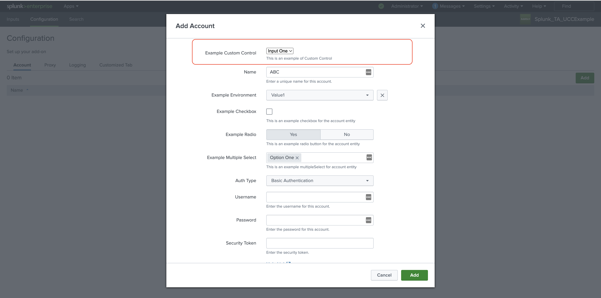
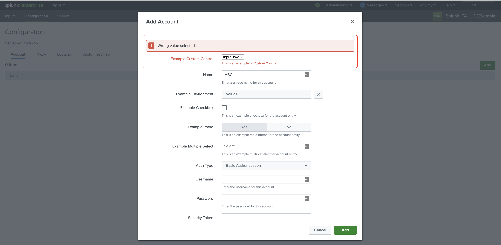

Custom Control class is used to create a custom input component.

Here is how you specify a custom control hook for a service/tab in the globalConfig.json file:
```
{
    "type": "custom",
    "options": {
        "src": "custom_control",
        "type": "external"
    }
}
```
The custom_control file's relative path to globalConfig is `appserver/static/js/build/custom/custom_control.js`

### Usage

Use custom control in the tabs:


### Properties

| Property          | Description |
| ----------------- | ----------- |
| globalConfig      | It is an hierarchical object having the properties and their values same as the globalConfig file. |
| el                | The html element of the custom row. |
| data              | This object has information about the value, mode of execution (create, edit, clone), service/tab name in which the custom component resides, etc. |
| setValue          | This method is used to set the value of the custom component. <p>setValue: ƒ (newValue)</p> |
| util              | This is a utility object with various functions that can be used to manipulate the page UI. There are 4 methods associated : <ul><li>`clearAllErrorMsg`: ƒ (State)</li><li>`setErrorFieldMsg`: ƒ (field, msg)</li><li>`setErrorMsg`: ƒ (msg)</li><li>`setState`: ƒ setState(callback)</li></ul>|

### Methods

| Property          | Description |
| ----------------- | ----------- |
| Render            | This method should contain the rendering logic for the custom component. This method is called when the create, edit or clone form is rendered. |
| Validation        | This method should contain the validation logic for the value of the custom component. |

### Example

```
class CustomControl {
    /**
     *
     * @constructor
     * @param {Object} globalConfig - Global configuration.
     * @param {element} el - The element of the custom row.
     * @param {string} data - Service name.
     * @param {object} util - the utility object
     * @param {function} setValue - set value of the custom field
     */
    constructor(globalConfig, el, data, setValue, util) {
        this.globalConfig = globalConfig;
        this.el = el;
        this.data = data;
        this.util = util;
        this.setValue = setValue;
    }

    render() {
        let content_html = `
            <select id="custom_control">
                <option value="input_one">Input One</option>
                <option value="input_two">Input Two</option>
            </select>
        `;

        this.el.innerHTML = content_html;

        $('select#custom_control').on('change', () => this._onCheckBoxChange());
        return this;
    }

    // This method is called when checkbox changed
    _onCheckBoxChange() {
        this._updateState();
    }

    _updateState() {
        const btn = document.querySelector('#custom_control');
        this.util.setState((prevState) => {
            const data = { ...prevState.data };
            data.custom_control_field.value = btn.value;
            return { data };
        });
    }

    validation(field, value) {
        // Validation logic for value. Return the error message if failed.
        if (value === 'input_two') {
            return 'Wrong value selected.';
        }
    }
}

export default CustomControl;
```

### Output

This is how custom control looks:


Here's how custom validations look:

