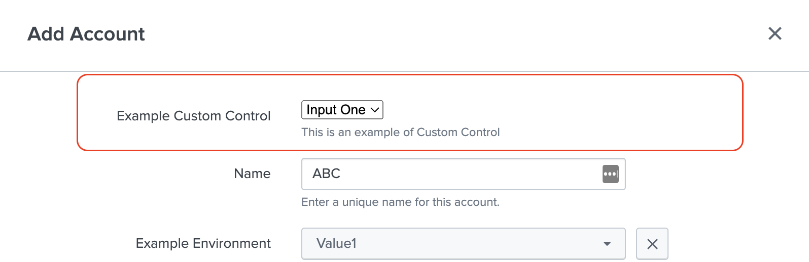

The Custom Control feature allows you to display any customised input component in a form. The developer can easily design and render any complex input component with this feature. Modern add-ons frequently require the use of complex input components, and this feature will allow you to use the custom component in the form that is best suited to your needs, without relying on newer releases of UCC for support. 

### Properties

| Property     | Description                                                                                                                                                                                                                                                                                   |
|--------------|-----------------------------------------------------------------------------------------------------------------------------------------------------------------------------------------------------------------------------------------------------------------------------------------------|
| globalConfig | It is a hierarchical object that contains the globalConfig file's properties and values.                                                                                                                                                                                                      |
| el           | The `el` is used to render a custom input element in a form.                                                                                                                                                                                                                                  |
| data         | The `data` object holds details regarding the execution mode (create, edit, clone), the value of a field, and the service name where this custom component is being rendered.                                                                                                                 |
| setValue     | This method is used to set the value of the custom component. <p>setValue: ƒ (newValue)</p>                                                                                                                                                                                                   |
| util         | This is a utility object with various functions that can be used to manipulate the UI. <br>There are 4 associated methods: <ul><li>`clearAllErrorMsg`: ƒ (State)</li><li>`setErrorFieldMsg`: ƒ (field, msg)</li><li>`setErrorMsg`: ƒ (msg)</li><li>`setState`: ƒ setState(callback)</li></ul> |

### Methods

| Property   | Description                                                                                                                                                |
|------------|------------------------------------------------------------------------------------------------------------------------------------------------------------|
| render     | is a method which should have logic for the custom component, and it will be executed automatically when the create, edit, or clone actions are performed. |
| validation | This method should contain the validation logic for the value of the custom component.                                                                     |

### Usage

```json
{
    "name": "account",
    "table": {},
    "entity": [
        {
            "type": "custom",
            "label": "Example Custom Control",
            "field": "custom_control_field",
            "help": "This is an example multipleSelect for account entity",
            "options":{
                "src": "custom_control",
                "type": "external"
            },
            "required": true
        },
        {
            "type": "text",
            "label": "Name",
            "options": {
                "placeholder": "Required"
            },
            "field": "name",
            "help": "Enter a unique name for this account.",
            "required": true
        },
    ]
}
```

### Example

```js
class CustomControl {
    /**
     *
     * @constructor
     * @param {object} globalConfig - Global configuration.
     * @param {element} el - The element of the custom row.
     * @param {object} data - Mode, serviceName, and value.
     * @param {object} util - The utility object.
     * @param {function} setValue - set value of the custom field.
     */
    constructor(globalConfig, el, data, setValue, util) {
        this.globalConfig = globalConfig;
        this.el = el;
        this.data = data;
        this.util = util;
        this.setValue = setValue;
    }

    _onSelectOptionChange() { }

    validation(field, value) {
        // Validation logic for value. Return the error message if failed.
        if (value === 'input_two') {
            return 'Wrong value selected.';
        }
    }

    render() {
        let content_html = `
            <select id="custom_control">
                <option value="input_one">Input One</option>
                <option value="input_two">Input Two</option>
            </select>
        `;

        this.el.innerHTML = content_html;

        $('select#custom_control').on('change', () => this._onSelectOptionChange());
        return this;
    }
}

export default CustomControl;
```

> Note: The Javascript file for the custom control should be saved in the custom folder at `appserver/static/js/build/custom/`.

### Output

This is how it looks in the UI:


