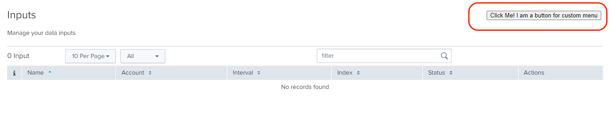

Custom Menu can be created when there is more than one input present on the inputs page. 

> This feature is deprecated (will be removed in the next major version) as [`Multilevel Menu`](https://splunk.github.io/addonfactory-ucc-generator/tabs/#multi-level-menu) is now ready to use if more than one input is available.

In addition to the multiple inputs, we can use this menu to create a custom component at the top right corner of the Input page.

### Properties

| Property          | Description |
| ----------------- | ----------- |
| globalConfig       | It is a hierarchical object that contains the globalConfig file's properties and values. |
| el                | The `el` is used to render a custom element (on the top right corner) on the Inputs page. |
| setValue          | This method is used to set the value of the custom component. <p>setValue: ƒ (newValue)</p> |

### Methods

| Property          | Description |
| ----------------- | ----------- |
| render            | `render` is a method which should have logic for the custom menu, and it will be executed automatically when inputs page is rendered. |

### Usage
```
"inputs": {
    "title": "Inputs",
    "description": "Manage your data inputs",
    "services": [],
    "table": {
        "actions": ["edit", "enable", "delete", "clone"],
        "header": [],
        "moreInfo": []
    },
    "menu": {
        "src": "custom_menu",
        "type": "external"
    }
}
```

### Example

```
class CustomMenu {

    /**
    * Custom Menu
    * @constructor
    * @param {Object} globalConfig - Global configuration.
    * @param {element} el - The element of the custom menu.
    * @param {function} setValue - set value of the custom field.
    */
    constructor(globalConfig, el, setValue) {
        this.globalConfig = globalConfig;
        this.el = el;
        this.setValue = setValue;
        this.services = {};
    }

    render() {
        this.el.innerHTML = '<button type="button">Click Me! I am a button for custom menu</button>'
        this.el.onclick = () => {
            this.setValue({
                service: "example_input_one" // The value of service can be the name of any services, specified in the globalConfig file.
            })
        }
    }
}
export default CustomMenu;
```

> Note: The Javascript file for the custom control should be saved in the custom folder at `appserver/static/js/build/custom/`.

### Output

This is how it looks like in the UI:


