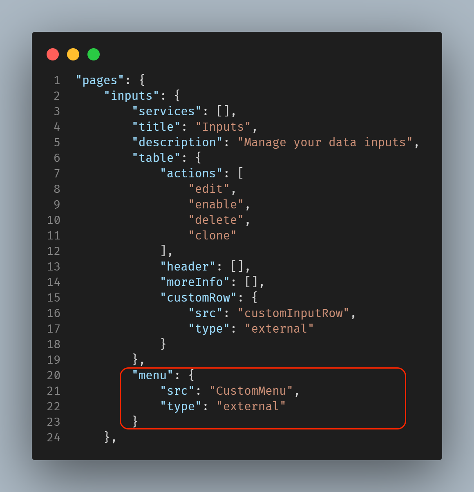
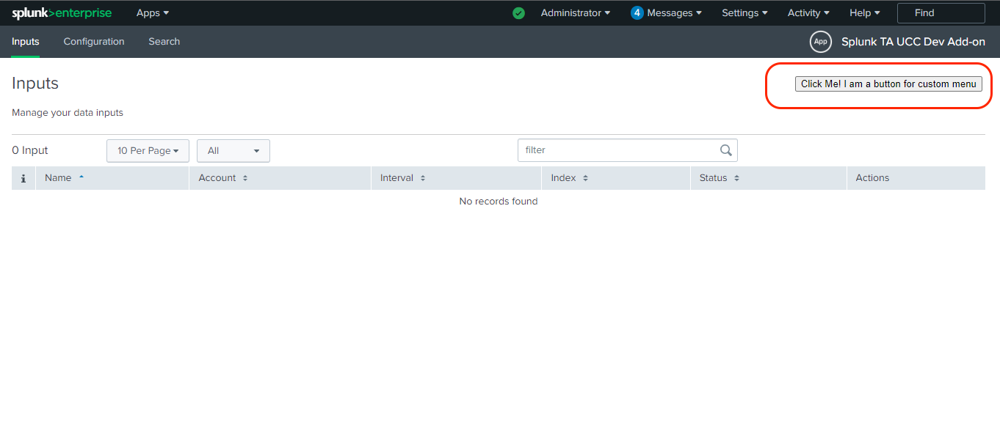

Custom Menu can be created when there is more than one input is present in the input page.

In addition to the multiple inputs, we can use this menu to create a custom component at the top right corner of the Input page.

Here is how you specify a custom menu:
```
"menu": {
  "src": "custom_menu",
  "type": "external"
}
```
The custom_menu file's relative path to globalConfig file is `appserver/static/js/build/custom/custom_menu.js`

### Usage

Use Custom Menu in the configuration table:


### Properties

| Property          | Description |
| ----------------- | ----------- |
| globalConfig      | It is an hierarchical object having the properties and their values same as the globalConfig file. |
| el                | The html element of the custom row. |
| setValue          | This method is used to set the value of the custom component. <p>setValue: ƒ (newValue)</p> |

### Methods

| Property          | Description |
| ----------------- | ----------- |
| Render            | This method should contain the rendering logic for the custom component. |

### Example

```
class CustomMenu {

    /**
    * Custom Menu
    * @constructor
    * @param {Object} globalConfig - Global configuration.
    * @param {element} el - The element of the custom menu.
    * @param {function} setValue - set value of the custom field
    */
    constructor(globalConfig, el, setValue) {
        this.globalConfig = globalConfig;
        this.el = el;
        this.setValue = setValue;
        this.services = {};
    }

    render() {
        this.el.innerHTML = '<button type="button">Click Me! I am a button for custom menu</button>'
        this.el.onclick = () => {
            this.setValue({
                service: "example_input_one" // The value of service can be the name of any services, specified in the globalConfig file.
            })
        }
    }
}
export default CustomMenu;
```

### Output

This is how custom menu looks:

