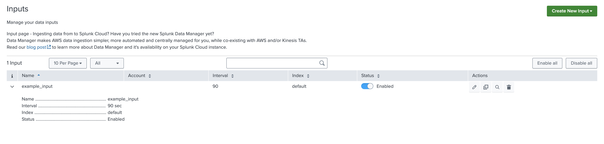

When a row is expanded on the Inputs table, Custom Row is utilized to incorporate a customized element. By clicking on the icon provided on the left side of each row, the input-specific details are displayed.

### Properties

| Property          | Description |
| ----------------- | ----------- |
| globalConfig       | It is a hierarchical object that contains the globalConfig file's properties and values. |
| el                | The `el` is used to render a customized element on the Inputs table when a row is expanded. |
| serviceName       | The name of the service/tab specified in the globalConfig file. |
| row               | The object of the record for which the CustomRowInput constructor is called. |

### Methods

| Property          | Description |
| ----------------- | ----------- |
| render            | `render` is a method which should have logic for the custom row component, and it will be executed automatically when the create, edit, or clone actions performed. |

### Usage

```
"inputs": {
    "title": "Inputs",
    "description": "Manage your data inputs",
    "services": [],
    "table": {
        "actions": ["edit", "enable", "delete", "clone"],
        "header": [],
        "customRow": {
            "src": "custom_input_row",
            "type": "external"
        }
    }
}
```


### Example

```
class CustomInputRow {
    /**
     * Custom Row Cell
     * @constructor
     * @param {Object} globalConfig - Global configuration.
     * @param {string} serviceName - Input service name.
     * @param {element} el - The element of the custom cell.
     * @param {Object} row - custom row object.
     */
    constructor(globalConfig, serviceName, el, row) {
        this.globalConfig = globalConfig;
        this.serviceName = serviceName;
        this.el = el;
        this.row = row;
    }

    render() {
        const content_html_template = 'Custom Input Row';
        this.el.innerHTML = content_html_template;
        return this;
    }
}
 
export default CustomInputRow;
```

> Note: The Javascript file for the custom control should be saved in the custom folder at `appserver/static/js/build/custom/`.

### Output

This is how it looks like in the UI:


