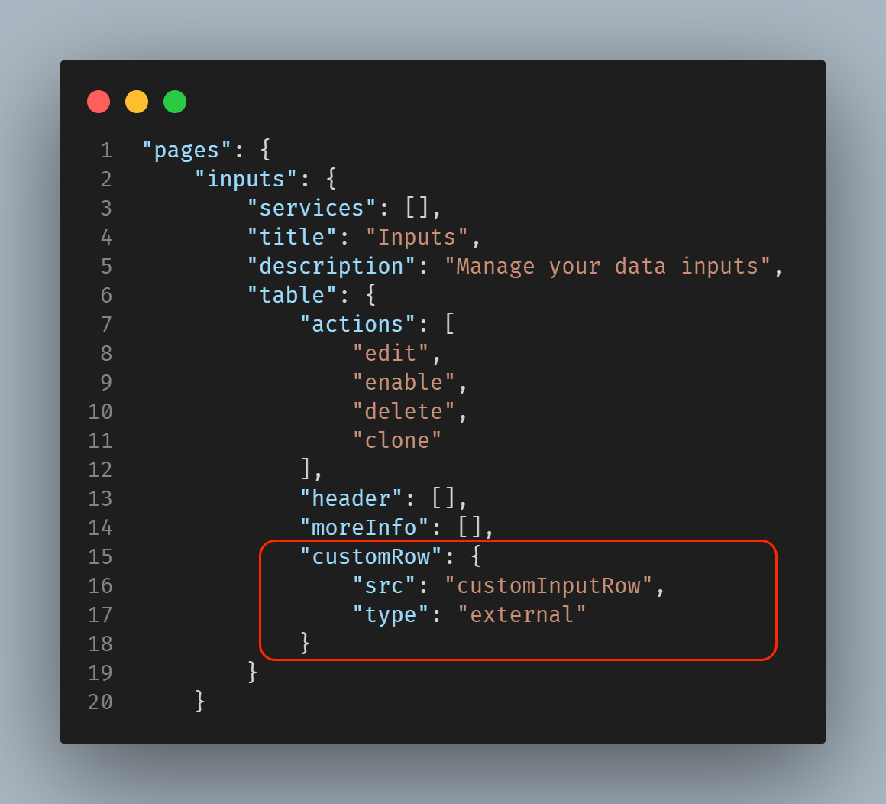

When clicking on the left side icon provided in each row, the input specific details are displayed.
To update the existing details, we can use the Custom Row feature.

Here is how you specify a custom row hook:
```
"customRow": {
  "src": "custom_row",
  "type": "external"
}
```
The custom_row file's relative path to globalConfig file is `appserver/static/js/build/custom/custom_row.js`

### Usage

Use Custom Row in the inputs table:


### Properties

| Property          | Description |
| ----------------- | ----------- |
| globalConfig      | It is an hierarchical object having the properties and their values same as the globalConfig file. |
| el                | The html element of the custom cell. |
| serviceName       | The name of the service/tab specified in the globalConfig file. |
| row               | The object of the record for which the CustomRowInput constructor is called. |

### Methods

| Property          | Description |
| ----------------- | ----------- |
| Render            | This method should contain the rendering logic for the custom component. This method is called when the create, edit or clone form is rendered. |

### Example

```
class CustomInputRow {
    /**
     * Custom Row Cell
     * @constructor
     * @param {Object} globalConfig - Global configuration.
     * @param {string} serviceName - Input service name.
     * @param {element} el - The element of the custom cell.
     * @param {Object} row - custom row object.
     */
    constructor(globalConfig, serviceName, el, row) {
        this.globalConfig = globalConfig;
        this.serviceName = serviceName;
        this.el = el;
        this.row = row;
    }

    render() {
        const content_html_template = 'Custom Input Row';
        this.el.innerHTML = content_html_template;
        return this;
    }
}
 
export default CustomInputRow;
```

### Output

This is how custom row looks:

