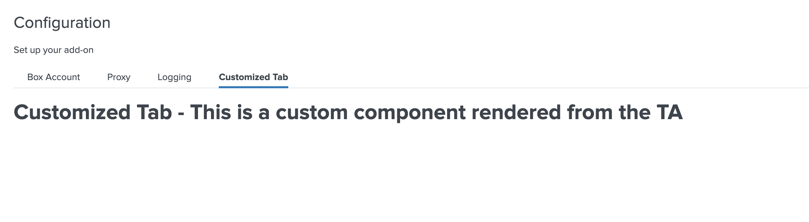

Custom Tab feature can be used to render any customized UI component in the TA. With this feature, the developer can design and render any complex input with ease. This is an advanced feature and can be leveraged with limitless functionalities. Modern TAs are receiving complex use cases and this feature will allow them to design the UI perfectly for their case without having to depend on the newer releases of UCC supporting their component.

### Usage

Use Custom Tab in the Configuration page:
```
"configuration": {
    "title": "Configuration",
    "descriptions": "Set up your add-on",
    "tabs": [
        {
            "name": "account",
            "title": "Account",
            "entity": [],
            "table": {}
        },
        {
            "name": "logging",
            "title": "Logging",
            "entity": []
        },
        {
            "name": "proxy",
            "title": "Proxy",
            "entity": []
        },
        {
            "name": "custom_tab",
            "title": "Customized Tab",
            "entity": []
            "customTab": {
                "src": "custom_tab",
                "type": "external"
            }
        }
    ]
}
```

### Properties

| Property | Description                                                                                        |
| -------- | -------------------------------------------------------------------------------------------------- |
| tab      | It is an object with the properties and values of a custom tab object from the global config file. |
| el       | The html element of the custom tab.                                                                |

### Methods

| Property | Description                                                              |
| -------- | ------------------------------------------------------------------------ |
| Render   | This method should contain the rendering logic for the custom component. |

### Example

```
class CustomTab {

    /**
    * Custom Tab
    * @constructor
    * @param {Object} tab - tab details.
    * @param {element} el - The element of the custom menu.
    */
    constructor(tab, el) {
        this.tab = tab;
        this.el = el;
    }

    render() {
        this.el.innerHTML = `<h1 style="margin-top: 20px">${this.tab.title} - This is a custom component rendered from the TA</h1>`
    }
}
export default CustomTab;
```

> Note: The Javascript file for the custom tab should be saved in the custom folder at `appserver/static/js/build/custom/`.

### Output

This is how Custom Tab looks:

