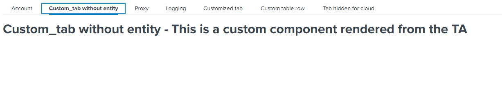

Custom Tab feature can be used to render any customized UI component in the Configuration tabs. With this feature, the developer can design and render any complex input with ease. This is an advanced feature and can be leveraged with limitless functionalities. Modern TAs are receiving complex use cases and this feature will allow them to design the UI perfectly for their case without having to depend on the newer releases of UCC supporting their component.

### Properties

| Property | Description                                                                                        |
| -------- | -------------------------------------------------------------------------------------------------- |
| tab      | It is an object with the properties and values of a custom tab object from the global config file. |
| el       | The `el` is used to render a customized component on the Configuration tabs. |

### Methods

| Property | Description                                                              |
| -------- | ------------------------------------------------------------------------ |
| render   | `render` is a method which should have logic for the custom component, and it will be executed automatically when configuration page is rendered. |

### Usage

```
"configuration": {
    "title": "Configuration",
    "descriptions": "Set up your add-on",
    "tabs": [
        {
            "name": "account",
            "title": "Account",
            "entity": [],
            "table": {}
        },
        {
            "name": "logging",
            "title": "Logging",
            "entity": []
        },
        {
            "name": "proxy",
            "title": "Proxy",
            "entity": []
        },
        {
            "name": "custom_tab",
            "title": "Customized Tab",
            "customTab": {
                "src": "custom_tab",
                "type": "external"
            }
        }
    ]
}
```

### Example

```
class CustomTab {

    /**
    * Custom Tab
    * @constructor
    * @param {Object} tab - Tab details.
    * @param {element} el - The element of the custom menu.
    */
    constructor(tab, el) {
        this.tab = tab;
        this.el = el;
    }

    render() {
        this.el.innerHTML = `<h1 style="margin-top: 20px">${this.tab.title} - This is a custom component rendered from the TA</h1>`
    }
}
export default CustomTab;
```

> Note: The Javascript file for the custom tab should be saved in the custom folder at `appserver/static/js/build/custom/`.

### Output

This is how it looks like in the UI:


