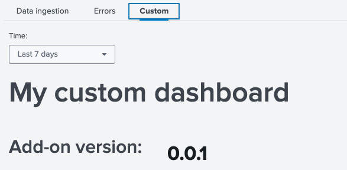
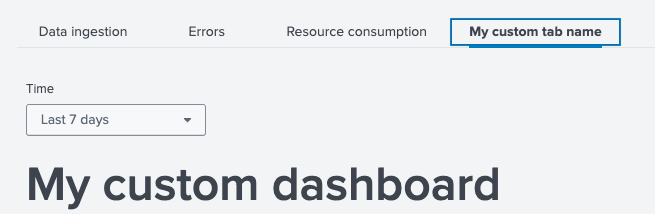

# Dashboard

## Overview

UCC introduces a monitoring dashboard page, which is available from v5.42.0.

Page is fully based on the UDF framework (Unified Dashboard Framework) and Splunk UI components. More information can be found [here](https://splunkui.splunk.com/Packages/dashboard-docs/?path=%2FIntroduction).

The dashboard page configuration is generated if the `ucc-gen init` command is used.
The dashboard page is optional, you can delete it from configuration if you
don't need it in your add-on.

The dashboard page provides some additional information about the add-on
operations to increase the visibility into what the add-on is actually doing
under the hood.

As of now, 4 pre-built panels are supported:

* Overview
* Data ingestion
* Errors in the add-on.
* Resource consumption.

**IMPORTANT**:

* To fully use the panels available on the monitoring dashboard, use the `solnlib.log`'s [`events_ingested` function](https://github.com/splunk/addonfactory-solutions-library-python/blob/v5.2.0/solnlib/log.py#L280), to record events.
Due to some changes in dashboard queries in UCC version **5.49.0**, you must use `solnlib` in at least version **5.2.0**.
* Sometimes, especially with a short data collection period, the first chart in the overview section may not display data when the **all time** period is selected.
This is because the `join` function used to aggregate data volume and number of ingested events does not have a default **span** for the **all time** range.
Over time, the problem should automatically disappear.

The above `events_ingested` function takes 5 positional parameters which are:

* `logger`
* `modular_input_name`
* `sourcetype`
* `n_events`
* `index`

and 2 optional named parameters:

* `account`
* `host`
* `license_usage_source` (available from version 5.2)

If you additionally provide `account` and `host` arguments - you will get a better visibility in your dashboard.
Please note that as a `modular_input_name` you should pass the full input in the format: **`demo_input://my_input_1`**.

If for your add-on `license usage` file writes data in a source format that doesn't fit the above, the `events_ingested` function in **solnlib v5.2**
has an additional, optional parameter `license_usage_source` that allows for proper data correlation
between license usage and data written by the `events_ingested` function.

Example of an `events_ingested` function:

```python
from solnlib import log


log.events_ingested(
    logger,
    "demo_input://my_input1",
    "my_sourcetype",
    2,
    "my_index",
    account="my_account"
)
```

as a reference, you can check the input in the demo add-on described [here](quickstart.md/#initialize-new-add-on).

**IMPORTANT**: From version **v5.46.0** the error section has been expanded to include a division into error categories. This solution is based on additional exception logging functions:

* `log_connection_error`
* `log_configuration_error`
* `log_permission_error`
* `log_authentication_error`
* `log_server_error`

Above functions take 2 mandatory parameters:

* `logger` - your add-on logger
* `exc` - exception thrown

and 3 optional parameters:

* `full_msg` - if set to True, full traceback will be logged. Default: True
* `msg_before` - custom message before exception traceback. Default: None
* `msg_after` - custom message after exception traceback. Default: None

Additionally, function [`log_exception`](https://github.com/splunk/addonfactory-solutions-library-python/blob/v5.0.0/solnlib/log.py#L329) has a new, **mandatory** parameter `exc_label` thanks to which you can log your own, non-standard types.

All of the above is available in the `log` module of the `solnlib` library from **version 5.0**. Please make sure you are using this version of `solnlib` library if you want to take full advantage of the extended error panel.

Example of a logging functions:

```python
from solnlib import log

...
except MyCustomException as e:
    log.log_exception(logger, e, "my custom error")
except UnauthorisedError as e:
    log.log_authentication_error(logger, e)
except PermissionError as e:
    log.log_permission_error(logger, e, msg_after="test after")
except ConnectionError as e:
    log.log_connection_error(logger, e, msg_before="test before", msg_after="test after")
except AddonConfigurationError as e:
    log.log_configuration_error(logger, e, full_msg=False, msg_before="test before")
except ServiceServerError as e:
    log.log_server_error(logger, e)
except Exception as e:
    log.log_exception(logger, e, "Other")
```

By default, the error section displays events logged with the ERROR level, but since version **5.50** UCC allows the user to define what level of logs should be displayed in this section. There are two levels to choose from:

* ERROR
* CRITICAL

```json
        "dashboard": {
            "panels": [
                {
                    "name": "default"
                }
            ],
            "settings": {
                "error_panel_log_lvl": [
                    "ERROR",
                    "CRITICAL"
                ]
            }
        }
```

## Configuration

To be able to add a monitoring dashboard page to an existing add-on, you need to adjust your
globalConfig file and include a new "dashboard" page there. See the following example:

```json
{
    "pages": {
        "configuration": {
            "tabs": [
                ...
            ],
            "title": "Configuration",
            "description": "Set up your add-on"
        },
        "inputs": {
            "services": [
                ...
            ],
            "title": "Inputs",
            "description": "Manage your data inputs",
            "table": {
                ...
            }
        },
        "dashboard": {
            "panels": [
                {
                    "name": "default"
                }
            ]
        }
    },
    "meta": {
      ...
    }
}
```

## Migration path

Default, XML-based dashboard will be migrated during the build process. All the necessary changes will be made automatically.

## Custom components

UCC also supports adding your own components to the dashboard.
To do this, create a **custom_dashboard.json** file in the add-on's root directory (at the same level as globalConfig.json).

This definition json file must be created according to the UDF framework standards described [here](https://splunkui.splunk.com/Packages/dashboard-docs/?path=%2FIntroduction)

**custom_dashboard.json** location:

```
<TA>
 ├── package
 ...
 ├── custom_dashboard.json
 ├── globalConfig.json
 ...
```

Sample **custom_dashboard.json** structure:

```json
{
  "visualizations": {
    "custom_dashboard_main_label": {
      "type": "splunk.markdown",
      "options": {
        "markdown": "# My custom dashboard",
        "fontSize": "extraLarge"
      }
    },
    "custom_addon_version_label": {
      "type": "splunk.markdown",
      "options": {
        "markdown": "# Add-on version:",
        "fontSize": "large"
      }
    },
    "custom_addon_version": {
      "type": "splunk.singlevalue",
      "options": {
        "majorFontSize": 34,
        "backgroundColor": "transparent"
      },
      "dataSources": {
        "primary": "custom_addon_version_ds"
      }
    },
    "custom_events_ingested_label": {
      "type": "splunk.markdown",
      "options": {
        "markdown": "# Events ingested by sourcetype:",
        "fontSize": "default"
      }
    },
    "custom_events_ingested": {
      "type": "splunk.line",
      "options": {
        "xAxisVisibility": "hide",
        "seriesColors": [
          "#A870EF"
        ],
        "yAxisTitleText": "Events ingested"
      },
      "title": "Events ingested by sourcetype",
      "dataSources": {
        "primary": "custom_events_ingested_ds"
      }
    }
  },
  "dataSources": {
    "custom_addon_version_ds": {
      "type": "ds.search",
      "options": {
        "query": "| rest services/apps/local/demo_addon_for_splunk splunk_server=local | fields version"
      }
    },
    "custom_events_ingested_ds": {
      "type": "ds.search",
      "options": {
        "query": "index=_internal source=*demo_addon* action=events_ingested\n| timechart sum(n_events) by sourcetype_ingested",
        "queryParameters": {
          "earliest": "$events_ingested_time.earliest$",
          "latest": "$events_ingested_time.latest$"
        }
      }
    }
  },
  "inputs": {
    "custom_events_ingested_input": {
      "options": {
        "defaultValue": "-7d,now",
        "token": "events_ingested_time"
      },
      "title": "Time",
      "type": "input.timerange"
    }
  },
  "layout": {
    "type": "grid",
    "globalInputs": [
      "custom_events_ingested_input"
    ],
    "structure": [
      {
        "item": "custom_dashboard_main_label",
        "position": {
          "x": 20,
          "y": 500,
          "w": 300,
          "h": 50
        }
      },
      {
        "item": "custom_addon_version_label",
        "position": {
          "x": 20,
          "y": 530,
          "w": 100,
          "h": 50
        }
      },
      {
        "item": "custom_addon_version",
        "position": {
          "x": 80,
          "y": 515,
          "w": 100,
          "h": 50
        }
      },
      {
        "item": "custom_events_ingested_label",
        "position": {
          "x": 20,
          "y": 550,
          "w": 100,
          "h": 50
        }
      },
      {
        "item": "custom_events_ingested",
        "position": {
          "x": 20,
          "y": 580,
          "w": 600,
          "h": 150
        }
      }
    ]
  }
}
```

Next, you have to add the **custom** panel to your dashboard page in globalConfig.json.

```json
{
...
        "dashboard": {
            "panels": [
                {
                    "name": "default"
                },
                {
                    "name": "custom"
                }
            ]
        }
...
}
```

By default, the custom dashboard will be added as an additional tab under the overview section called `Custom`.



If you would like to change the tab name from **Custom** to any other value, you can do it in the `globalConfig.json`.
Global config, from UCC version **v5.47.0**, has an additional `settings` parameter for the dashboard section. To change the name of a custom tab, add the `custom_tab_name` attribute in the `settings`.

```json
{
...
        "dashboard": {
            "panels": [
                {
                    "name": "custom"
                }
            ],
            "settings": {
                "custom_tab_name": "My custom tab name"
            }
        },
...
}
```



It is possible to enable only a custom panel. To do this, remove the "default" element from globalConfig.json.

```json
{
...
        "dashboard": {
            "panels": [
                {
                    "name": "custom"
                }
            ]
        }
...
}
```

## Data volume

To obtain information on data volume usage, the monitoring dashboard uses logs saved in the `license_usage.log` file.
By default, data filtering for a specific add-on is based on the `source` (s) and names of individual inputs.
e.g.

`...source=*license_usage.log type=Usage (s IN (demo_addon_release_2*,my_input_2*))...`

If data is saved in your add-on with different, non-standard values or if filtering logs
using the source is not possible, **UCC v5.47** offers the ability to define how the search engine should
find data regarding a given add-on.
To do this, you need to add the `custom_license_usage` parameter in globalconfig in the **dashboard** -> **settings** section.
This parameter takes 2 mandatory items:

* `determine_by` -> is used to determine the filtering basis. It can take one of 4 possible arguments: ("source", "sourcetype", "host", "index").
* `search_condition` -> list of strings type parameter where you can provide elements that will be used to filter events in the license usage file.

e.g. of globalConfig.json:

```json
{
...
        "dashboard": {
            "panels": [
                {
                    "name": "custom"
                }
            ],
            "settings": {
                "custom_license_usage": {
                    "determine_by": "sourcetype",
                    "search_condition": [
                        "*addon123*",
                        "my_custom_condition*"
                    ]
                }
            }
        },
...
}
```

the above configuration will create the following filter query:
`...source=*license_usage.log type=Usage (st IN ("*addon123*","my_custom_condition*"))...`

> Note:

> - In the Data Ingestion table, the first column displays the `View by` options list. When you click on any row in this column, a modal opens, showing detailed information such as `Data volume` and the `Number of events` over time, visualized in charts. The modal allows you to adjust the options via a dropdown to view data for different View by options. This enables dynamic exploration of data trends for various selected inputs.