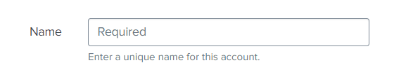
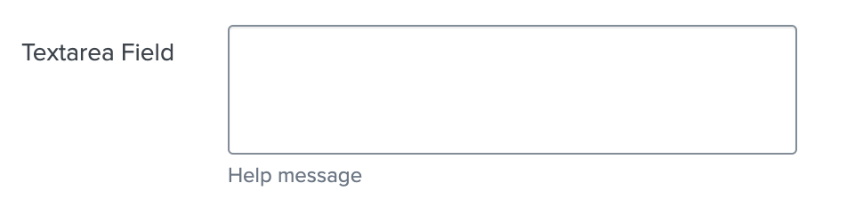
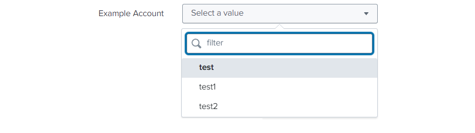

# Components supported by UCC

Components are used by UCC to render the Inputs and Configuration pages. Here is the list of the supported components. 

## `Text`

Underlying `@splunk/react-ui` component: [`Text`](https://splunkui.splunk.com/Packages/react-ui/Text).

Example usage below:

```json
{
    "type": "text",
    "label": "Name",
    "validators": [
        {
            "type": "string",
            "errorMsg": "Length of Name should be between 1 to 50 characters.",
            "minLength": 1,
            "maxLength": 50
        },
        {
            "type": "regex",
            "errorMsg": "Name must begin with a letter and consist exclusively of alphanumeric characters and underscores.",
            "pattern": "^[a-zA-Z]\\w*$"
        }
    ],
    "options": {
        "placeholder": "Required"
    },
    "field": "name",
    "help": "Enter a unique name for this account.",
    "required": true
}
```

This is how it looks like in the UI:




## `Text Area`

Underlying `@splunk/react-ui` component: [`TextArea`](https://splunkui.splunk.com/Packages/react-ui/TextArea).

`textarea` component is very similar to `text` component, but allows to have a multi-line input for text.

<h3> Options </h3>

| Property | Type   | Description                        | Default Value |
| -------- | ------ | ---------------------------------- | ------------- |
| rowsMax  | number | Maximum number of rows to display. | 12            |
| rowsMin  | number | Minimum number of rows to display. | 8             |

Example usage below:

```json
{
    "type": "textarea",
    "label": "Textarea Field",
    "field": "textarea_field",
    "help": "Help message",
    "options": {
        "rowsMin": 3,
        "rowsMax": 15
    },
    "required": true
}
```

This is how it looks like in the UI:




## `Single Select`

A `singleSelect` is a feature that combines a drop-down box, and/or editable text field, giving the user multiple ways to input or select the desired information.

Underlying `@splunk/react-ui` components: [`Select`](https://splunkui.splunk.com/Packages/react-ui/Select) or [`Combo Box`](https://splunkui.splunk.com/Packages/react-ui/ComboBox) depending on the `createSearchChoice` option. 

When the `createSearchChoice` option is set to true, the Singleselect component becomes a text input with autocomplete.

A clear button is visible to the right of the dropdown when this field is marked as required.

<h3> Options </h3>

| Property                                          | Type    | Description                                                                                                                                                                 | Default Value |
| ------------------------------------------------- | ------- | --------------------------------------------------------------------------------------------------------------------------------------------------------------------------- | ------------- |
| disableSearch                                     | boolean | Determines whether to show the filter box. When false, the children are automatically filtered based on the label.                                                          | false         |
| createSearchChoice                                | boolean | Allow the user to add arbitrary values.                                                                                                                                     | false         |
| referenceName                                     | string  | Dropdown options will be generated via an API call to the service's restHandler.                                                                                            | -             |
| endpointUrl                                       | string  | Dropdown options will be generated via an API call to that endpoint.                                                                                                        | -             |
| allowList                                         | string  | It only accepts options that match the regex based on the name attribute when received via API call using `endpointUrl` and `referenceName`. It is applied before denyList. | -             |
| denyList                                          | string  | It filters options that don't match the regex based on the name attribute when received via API call using `endpointUrl` and `referenceName`.                               | -             |
| labelField                                        | string  | TBD                                                                                                                                                                         | -             |
| [dependencies](../advanced/dependent_dropdown.md) | array   | It is used to update options via an API call when the value of any field in the dependencies list is updated.                                                               | -             |


<h3> Example usage below: </h3>

<h4> Using referenceName option </h4>

```json
{
    "type": "singleSelect",
    "label": "Example Account",
    "options": {
        "referenceName": "account"
    },
    "help": "",
    "field": "account",
    "required": true
}
```

This is how it looks like in the UI:



<h4> Using autoCompleteFields Options </h4>

```json
{
    "type": "singleSelect",
    "label": "Proxy Type",
    "options": {
        "disableSearch": true,
        "autoCompleteFields": [
            {
                "value": "http",
                "label": "http"
            },
            {
                "value": "socks5",
                "label": "socks5"
            }
        ]
    },
    "defaultValue": "http",
    "field": "proxy_type"
}
```

This is how it looks like in the UI:


<h4> Using createSearchChoice option </h4>

```json
{
    "type": "singleSelect",
    "label": "Index",
    "validators": [
        {
            "type": "string",
            "errorMsg": "Length of index name should be between 1 to 80 characters.",
            "minLength": 1,
            "maxLength": 80
        }
    ],
    "defaultValue": "default",
    "options": {
        "endpointUrl": "data/indexes",
        "denyList": "^_.*$",
        "createSearchChoice": true
    },
    "field": "index",
    "required": true
}
```

This is how it looks like in the UI:


<h4> Using autoCompleteFields option with groups </h4>

```json
{
    "field": "singleSelectTest",
    "label": "Single Select Group Test",
    "type": "singleSelect",
    "options": {
        "createSearchChoice": true,
        "autoCompleteFields": [
            {
                "label": "Group1",
                "children": [
                    {
                        "value": "one",
                        "label": "One"
                    },
                    {
                        "value": "two",
                        "label": "Two"
                    }
                ]
            },
            {
                "label": "Group2",
                "children": [
                    {
                        "value": "three",
                        "label": "Three"
                    },
                    {
                        "value": "four",
                        "label": "Four"
                    }
                ]
            }
        ]
    }
}
```

This is how it looks like in the UI:


## `Checkbox`

Underlying `@splunk/react-ui` component: [`Switch`](https://splunkui.splunk.com/Packages/react-ui/Switch).

Example usage below:

```json
{
    "type": "checkbox",
    "label": "Enable",
    "field": "proxy_enabled"
}
```

This is how it looks like in the UI:


## `Multiple Select`

Underlying `@splunk/react-ui` component: [`Multiselect`](https://splunkui.splunk.com/Packages/react-ui/Multiselect).

Multiselect allows the user to select multiple options at once.

<h3> Options </h3>

| Property                                          | Type    | Description                                                                                                                                                                                              | Default Value |
| ------------------------------------------------- | ------- | -------------------------------------------------------------------------------------------------------------------------------------------------------------------------------------------------------- | ------------- |
| items                                             | array   | The arrayof options with label and value.                                                                                                                                                                | -             |
| delimiter                                         | string  | It delimits each value of the field with a predefined character. <br>For example, In the data option_a\|option_b, a vertical bar (the pipe character) delimits the two data items option_a and option_b.   | comma(`,`)    |
| createSearchChoice                                | boolean | Allow the user to add arbitrary values.                                                                                                                                                                  | false         |
| referenceName                                     | string  | Dropdown options will be generated via an API call to the service's restHandler.                                                                                                                         | -             |
| endpointUrl                                       | string  | Dropdown options will be generated via an API call to that endpoint.                                                                                                                                     | -             |
| allowList                                         | string  | It only accepts options that match the regex based on the name attribute when received via API call using `endpointUrl` and `referenceName`. It is applied before denyList.                              | -             |
| denyList                                          | string  | It filters options that don't match the regex based on the name attribute when received via API call using `endpointUrl` and `referenceName`.                                                             | -             |
| labelField                                        | string  | TBD                                                                                                                                                                                                      | -             |
| [dependencies](../advanced/dependent_dropdown.md) | array   | It is used to update options via an API call when the value of any field in the dependencies list is updated.                                                                                             | -             |

Example usage below:

```json
{
    "type": "multipleSelect",
    "field": "test_multiselect",
    "label": "Test Multiselect",
    "options": {
        "delimiter": "|",
        "items": [
            {
                "value": "option_a",
                "label": "Option A"
            },
            {
                "value": "option_b",
                "label": "Option B"
            }
        ]
    }
}
```

This is how it looks like in the UI:


## `Radio Bar`

Underlying `@splunk/react-ui` component: [`RadioBar`](https://splunkui.splunk.com/Packages/react-ui/RadioBar).

RadioBar is a component that provides the ability to select one option out of a group. It can be used when we need to select a field value from a few options.

<h3> Options </h3>

| Property                                      | Type  | Description                                | Default Value |
| --------------------------------------------- | ----- | ------------------------------------------ | ------------- |
| items<span class="required-asterisk">*</span> | array | The array of options with label and value. | -             |

Example usage below:

```json
{
    "field": "test_radio",
    "label": "Test Radio",
    "type": "radio",
    "defaultValue": "Yes",
    "required": false,
    "options": {
        "items": [
            {
                "value": "yes",
                "label": "Yes"
            },
            {
                "value": "no",
                "label": "No"
            }
        ],
        "display": true
    }
}
```

This is how it looks like in the UI:


## `Help Link`

Underlying `@splunk/react-ui` component: [`Link`](https://splunkui.splunk.com/Packages/react-ui/Link).

It will open the link in a new tab.

<h3> Options </h3>

| Property                                     | Type   | Description                             | Default Value |
| -------------------------------------------- | ------ | --------------------------------------- | ------------- |
| text<span class="required-asterisk">*</span> | string | A message to be display in form.        | -             |
| link<span class="required-asterisk">*</span> | string | Link where the user will be redirected. | -             |

Example usage below:

```json
{
    "field": "example_help_link",
    "label": "",
    "type": "helpLink",
    "options": {
        "text": "Help Link",
        "link": "https://docs.splunk.com/Documentation",
    }
}
```

This is how it looks like in the UI:


## `File`

Underlying `@splunk/react-ui` component: [`File`](https://splunkui.splunk.com/Packages/react-ui/File).

It supports files that can be opened in text mode or with a text editor. Files with extensions such as txt, json, xml, yaml, pem, key, crt, etc.

It only sends file content to the server by reading it using the [readAsArrayBuffer](https://developer.mozilla.org/en-US/docs/Web/API/FileReader/readAsArrayBuffer) method of the FileReader class and then decoding it into **UTF-8** format using the [decode](https://developer.mozilla.org/en-US/docs/Web/API/TextDecoder/decode) method of the TextDecoder class.

File content can be validated using in-built validators like [string](../validators/#string) and [regex](../validators/#regex), and a custom validator can also be implemented using a [custom hook](../../custom_ui_extensions/custom_hook) and [saveValidator](../advanced/save_validator).

This feature allows you to upload a single file.

<h3> Options </h3>

| Property                                                   | Type   | Description                                                | Default Value |
| ---------------------------------------------------------- | ------ | ---------------------------------------------------------- | ------------- |
| fileSupportMessage                                          | string | To display message inside file component.                   | -             |
| supportedFileTypes<span class="required-asterisk">*</span> | array  | A list of the file types that the user can upload.          | -             |
| maxFileSize                                                | number | To set the maximum file size in KB that a user can upload.  | 500KB         |

Example usage below:

```json
{
    "type": "file",
    "label": "SA certificate",
    "help": "Upload service account's certificate",
    "field": "service_account",
    "options": {
        "fileSupportMessage": "Support message",
        "supportedFileTypes": ["pem", "txt"],
        "maxFileSize": 100
    },
    "validators": [
        {
            "type": "regex",
            "pattern": "(-----BEGIN CERTIFICATE-----(\n|\r|\r\n)([0-9a-zA-Z\+\/=]{64}(\n|\r|\r\n))*([0-9a-zA-Z\+\/=]{1,63}(\n|\r|\r\n))?-----END CERTIFICATE-----)"
        }
    ],
    "encrypted": true,
    "required": true
}
```

This is how it looks like in the UI:


## `OAuth`
The Oauth type entity enables us to use Oauth2.0 for user authentication. Visit the [Oauth Support](../advanced/oauth_support.md) page to learn more.


## `Custom`

Custom type entity enables us to create our own custom inputs within the Form components. As a result, we may include our own custom input fields on the form. Visit the [Custom Control](../custom_ui_extensions/custom_control.md) page to learn more.
