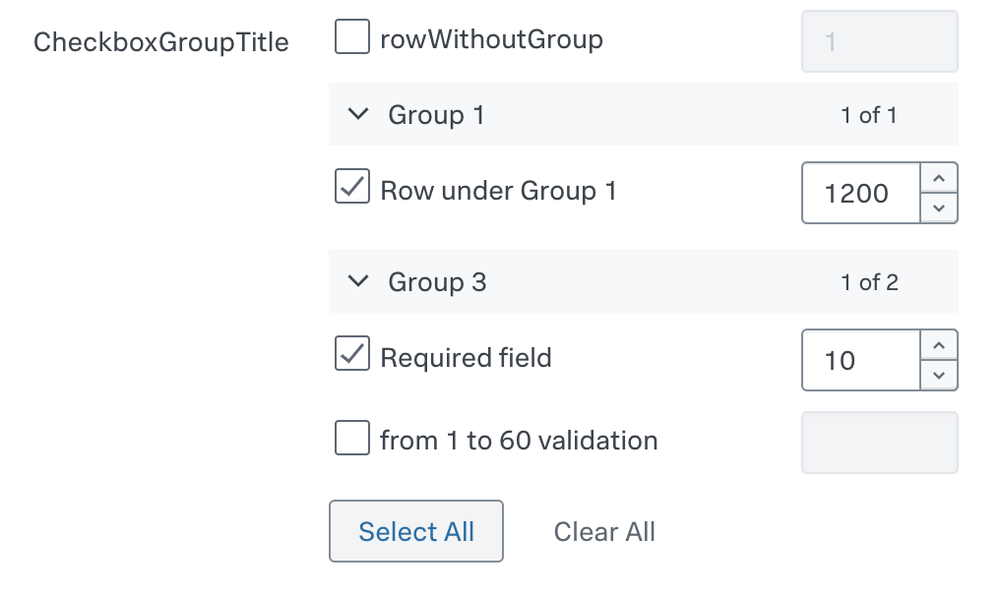

# Components supported by UCC

Components are used by UCC to render the Inputs and Configuration pages. See the following list of the supported components.

For a detailed look at our component implementations and to interact with them in a live environment, visit our <a href="/addonfactory-ucc-generator/storybook">Storybook library</a>.

## `Text`

See the underlying `@splunk/react-ui` component: [`Text`](https://splunkui.splunk.com/Packages/react-ui/Text).

See the following example usage:

```json
{
    "type": "text",
    "label": "Name",
    "validators": [
        {
            "type": "string",
            "errorMsg": "Length of Name should be between 1 to 50 characters.",
            "minLength": 1,
            "maxLength": 50
        },
        {
            "type": "regex",
            "errorMsg": "Name must begin with a letter and consist exclusively of alphanumeric characters and underscores.",
            "pattern": "^[a-zA-Z]\\w*$"
        }
    ],
    "field": "name",
    "help": "Enter a unique name for this account.",
    "required": true
}
```

This is how it looks in the UI:


## `Text Area`

See the underlying `@splunk/react-ui` component: [`TextArea`](https://splunkui.splunk.com/Packages/react-ui/TextArea).

The `textarea` component is very similar to the `text` component, but allows you to have a multi-line input for text.

### Options

| Property | Type   | Description                        | Default Value |
| -------- | ------ | ---------------------------------- | ------------- |
| rowsMax  | number | Maximum number of rows to display. | 12            |
| rowsMin  | number | Minimum number of rows to display. | 8             |

See the following example:

```json
{
    "type": "textarea",
    "label": "Textarea Field",
    "field": "textarea_field",
    "help": "Help message",
    "options": {
        "rowsMin": 3,
        "rowsMax": 15
    },
    "required": true
}
```

This is how it looks in the UI:


## `Single Select`

A `singleSelect` is a feature that combines a drop-down box, and/or editable text field, giving the user multiple ways to input or select the desired information.

See the underlying `@splunk/react-ui` components: [`Select`](https://splunkui.splunk.com/Packages/react-ui/Select) or [`Combo Box`](https://splunkui.splunk.com/Packages/react-ui/ComboBox) depending on the `createSearchChoice` option.

When the `createSearchChoice` option is set to true, the Singleselect component becomes a text input with auto-complete.

A clear button is visible to the right of the dropdown when this field is marked as required.

### Options

| Property                                          | Type    | Description                                                                                                                                                                                   | Default Value |
| ------------------------------------------------- | ------- | --------------------------------------------------------------------------------------------------------------------------------------------------------------------------------------------- | ------------- |
| disableSearch                                     | boolean | It determines whether to show the filter box. When false, the children are automatically filtered based on the label.                                                                         | false         |
| createSearchChoice                                | boolean | It allows the user to add arbitrary values.                                                                                                                                                   | false         |
| referenceName                                     | string  | Dropdown options will be generated via an API call to the service's restHandler.                                                                                                              | -             |
| endpointUrl                                       | string  | Dropdown options will be generated via an API call to that endpoint.                                                                                                                          | -             |
| allowList                                         | string  | It only accepts options that match the regex based on the name attribute when received via an API call using `endpointUrl` and `referenceName`. It is applied before denyList.                | -             |
| denyList                                          | string  | It filters options that don't match the regex based on the name attribute when received via an API call using `endpointUrl` and `referenceName`.                                              | -             |
| labelField                                        | string  | If you use endpointUrl and your data are not simple text data, you can specify here which property of retrieved object should be used as label for each item.```item.content?.[labelField]``` | -             |
| valueField                                        | string  | If you use endpointUrl and your data are not simple text data, you can specify here which property of retrieved object should be used as value for each item.```item.content?.[valueField]``` | -             |
| [dependencies](../advanced/dependent_dropdown.md) | array   | It is used to update the options via an API call when the value of any field in the dependencies list is updated.                                                                             | -             |

> When using [Boolean](https://docs.splunk.com/Documentation/Splunk/latest/SearchReference/ListOfDataTypes) values on any form inside configuration page, consider that inside splunk values like 'TRUE', 'T', 'Y', 'YES', true will be converted into '1' and values like 'FALSE', 'F', 'N', 'NO', 'NONE', false will be converted into '0'.
>
> Consider using values '0' and '1' as false and true values.

### See the following example usage

#### Using referenceName option

```json
{
    "type": "singleSelect",
    "label": "Example Account",
    "options": {
        "referenceName": "account",
        "allowList": "^[a-zA-Z]\\w*$"
    },
    "help": "",
    "field": "account",
    "required": true
}
```

This is how it looks in the UI:


#### Using autoCompleteFields Options

```json
{
    "type": "singleSelect",
    "label": "Proxy Type",
    "options": {
        "disableSearch": true,
        "autoCompleteFields": [
            {
                "value": "http",
                "label": "http"
            },
            {
                "value": "socks5",
                "label": "socks5"
            }
        ]
    },
    "defaultValue": "http",
    "field": "proxy_type"
}
```

This is how it looks in the UI:


#### Using createSearchChoice option

```json
{
    "type": "singleSelect",
    "label": "Index",
    "validators": [
        {
            "type": "string",
            "errorMsg": "Length of index name should be between 1 to 80 characters.",
            "minLength": 1,
            "maxLength": 80
        }
    ],
    "defaultValue": "default",
    "options": {
        "endpointUrl": "data/indexes",
        "denyList": "^_.*$",
        "createSearchChoice": true
    },
    "field": "index",
    "required": true
}
```

This is how it looks in the UI:


#### Using autoCompleteFields option with groups

```json
{
    "field": "singleSelectTest",
    "label": "Single Select Group Test",
    "type": "singleSelect",
    "options": {
        "createSearchChoice": true,
        "autoCompleteFields": [
            {
                "label": "Group1",
                "children": [
                    {
                        "value": "one",
                        "label": "One"
                    },
                    {
                        "value": "two",
                        "label": "Two"
                    }
                ]
            },
            {
                "label": "Group2",
                "children": [
                    {
                        "value": "three",
                        "label": "Three"
                    },
                    {
                        "value": "four",
                        "label": "Four"
                    }
                ]
            }
        ]
    }
}
```

This is how it looks in the UI:


## `Checkbox`

See the underlying `@splunk/react-ui` component: [`Switch`](https://splunkui.splunk.com/Packages/react-ui/Switch).

See the following example usage:

```json
{
    "type": "checkbox",
    "label": "Enable",
    "field": "proxy_enabled"
}
```

This is how it looks in the UI:


## `CheckboxGroup`

### Options

| Property                                     | Type   | Description                                                                                                                                                                                         | Default Value |
| -------------------------------------------- | ------ | --------------------------------------------------------------------------------------------------------------------------------------------------------------------------------------------------- | ------------- |
| rows<span class="required-asterisk">*</span> | array  | rows defines each individual row within the checkboxGroup control.                                                                                                                                  | -             |
| groups                                       | array  | groups logically organize related checkboxes under a common label within the checkboxGroup control.                                                                                                 | -             |
| delimiter                                    | string | Values are combined into a single field using a predefined delimiter. Assuming the delimiter is \ (backslash character), the combined value would look like: `rowUnderGroup1/1200\requiredField/10` | comma(`,`)    |


See the following example usage:

```json
{
  "type": "checkboxGroup",
  "label": "CheckboxGroupTitle",
  "field": "api3",
  "options": {
    "groups": [
      {
        "label": "Group 1",
        "options": {
          "isExpandable": true,
          "expand": true
        },
        "fields": ["rowUnderGroup1"]
      },
      {
        "label": "Group 3",
        "options": {
          "isExpandable": true,
          "expand": true
        },
        "fields": ["field223", "160validation"]
      }
    ],
    "rows": [
      {
        "field": "rowWithoutGroup",
        "input": {
          "defaultValue": 1,
          "required": true
        }
      },
      {
        "field": "rowUnderGroup1",
        "checkbox": {
          "label": "Row under Group 1",
          "defaultValue": true
        },
        "input": {
          "defaultValue": 1200,
          "required": false
        }
      },
      {
        "field": "field223",
        "checkbox": {
          "label": "Required field",
          "defaultValue": true
        },
        "input": {
          "required": true
        }
      },
      {
        "field": "160validation",
        "checkbox": {
          "label": "from 1 to 60 validation"
        },
        "input": {
          "validators": [
            {
              "type": "number",
              "range": [1, 60]
            }
          ]
        }
      }
    ]
  }
}
```

This is how it looks in the UI:



The component maps and unmaps values into a single field in the format `fieldName1/fieldValue1,fieldName2/fieldValue2`, but only for checked rows. For the given example, it emits the following value: `rowUnderGroup1/1200,requiredField/10`.


## `CheckboxTree`

### Options

| Property                                     | Type   | Description                                                                                                                                                                                                       | Default Value |
| -------------------------------------------- | ------ | ----------------------------------------------------------------------------------------------------------------------------------------------------------------------------------------------------------------- | ------------- |
| rows<span class="required-asterisk">*</span> | array  | rows defines each individual row within the checkboxTree control.                                                                                                                                                 | -             |
| groups                                       | array  | groups logically organize related checkboxes under a common label within the checkboxTree control.                                                                                                                | -             |
| delimiter                                    | string | Values are combined into a single field using a predefined delimiter. Assuming the delimiter is \ (backslash character), the combined value would look like: `rowWithoutGroup\rowUnderGroup1\firstRowUnderGroup3` | comma(`,`)    |


See the following example usage:

```json
 {
    "type": "checkboxTree",
    "label": "CheckboxTreeTitle",
    "field": "api3",
    "options": {
    "groups": [
        {
            "label": "Group 1",
            "options": {
                "isExpandable": true,
                "expand": true
            },
            "fields": ["rowUnderGroup1"]
        },
        {
            "label": "Group 3",
            "options": {
                "isExpandable": true,
                "expand": true
            },
            "fields": ["firstRowUnderGroup3", "secondRowUnderGroup3", "thirdRowUnderGroup3"]
        }
    ],
    "rows": [
        {
            "field": "rowWithoutGroup",
            "checkbox": {
                "label": "Row without group",
                "defaultValue": true
            }
        },
        {
            "field": "rowUnderGroup1",
            "checkbox": {
                "label": "Row under Group 1",
                "defaultValue": true
            }
        },
        {
            "field": "firstRowUnderGroup3",
            "checkbox": {
                "label": "first row under group 3",
                "defaultValue": true
            }
        },
        {
            "field": "secondRowUnderGroup3",
            "checkbox": {
                "label": "second row under group 3"
            }
        },
        {
            "field": "thirdRowUnderGroup3",
            "checkbox": {
                "label": "third row checked under group 3",
                "defaultValue": true
            }
        }
    ]
    }
}
```

This is how it looks in the UI:


The component maps and unmaps values into a single field in the format `fieldName1,fieldName2,fieldName3`, but only for checked rows. For the given example, it emits the following value: `rowWithoutGroup,rowUnderGroup1,firstRowUnderGroup3`.

## `Date`

See the underlying `@splunk/react-ui` component: [`Date`](https://splunkui.splunk.com/Packages/react-ui/Date).

See the following example usage:
```json
{
    "type": "date",
    "field": "example_date",
    "label": "Date",
    "required": true
}
```

This is how it looks in the UI:


## `Multiple Select`

See the underlying `@splunk/react-ui` component: [`Multiselect`](https://splunkui.splunk.com/Packages/react-ui/Multiselect).

Multiselect allows the user to select multiple options at once.

### Options

| Property                                                | Type    | Description                                                                                                                                                                                              | Default Value |
| ------------------------------------------------------- | ------- | -------------------------------------------------------------------------------------------------------------------------------------------------------------------------------------------------------- | ------------- |
| items                                                   | array   | An array of options with a label and a value.                                                                                                                                                            | -             |
| delimiter                                               | string  | It delimits each value of the field with a predefined character. <br>For example, In the data option_a\|option_b, a vertical bar (the pipe character) delimits the two data items option_a and option_b. | comma(`,`)    |
| createSearchChoice                                      | boolean | It allows the user to add arbitrary values.                                                                                                                                                              | false         |
| referenceName                                           | string  | Dropdown options will be generated via an API call to the service's restHandler.                                                                                                                         | -             |
| endpointUrl                                             | string  | Dropdown options will be generated via an API call to that endpoint.                                                                                                                                     | -             |
| allowList                                               | string  | It only accepts options that match the regex based on the name attribute when received via API call using `endpointUrl` and `referenceName`. It is applied before denyList.                              | -             |
| denyList                                                | string  | It filters options that don't match the regex based on the name attribute when received via API call using `endpointUrl` and `referenceName`.                                                            | -             |
| labelField                                              | string  | If you use endpointUrl and your data are not simple text data, you can specify here which property of retrieved object should be used as label for each item.```item.content?.[labelField]```            | -             |
| valueField                                              | string  | If you use endpointUrl and your data are not simple text data, you can specify here which property of retrieved object should be used as value for each item.```item.content?.[valueField]```            | -             |
| [dependencies](../advanced/dependent_dropdown.md)       | array   | It is used to update options via an API call when the value of any field in the dependencies list is updated.                                                                                            | -             |
| [autoCompleteFields](#using-autocompletefields-options) | array   | It is used to add options in the Single select or Multiple select component.                                                                                                                             | -             |

See the following example usage:

```json
{
    "type": "multipleSelect",
    "field": "test_multiselect",
    "label": "Test Multiselect",
    "options": {
        "delimiter": "|",
        "items": [
            {
                "value": "option_a",
                "label": "Option A"
            },
            {
                "value": "option_b",
                "label": "Option B"
            }
        ]
    }
}
```

This is how it looks in the UI:


## `Radio Bar`

See the underlying `@splunk/react-ui` component: [`RadioBar`](https://splunkui.splunk.com/Packages/react-ui/RadioBar).

RadioBar is a component that provides the ability to select one option out of a group. It can be used when we need to select a field value from a few options.

### Options

| Property                                      | Type  | Description                                                    | Default Value |
| --------------------------------------------- | ----- | -------------------------------------------------------------- | ------------- |
| items<span class="required-asterisk">*</span> | array | This property is an array of options with a label and a value. | -             |

See the following example usage:

```json
{
    "field": "test_radio",
    "label": "Test Radio",
    "type": "radio",
    "defaultValue": "Yes",
    "required": false,
    "options": {
        "items": [
            {
                "value": "yes",
                "label": "Yes"
            },
            {
                "value": "no",
                "label": "No"
            }
        ],
        "display": true
    }
}
```

This is how it looks in the UI:


> When using [Boolean](https://docs.splunk.com/Documentation/Splunk/latest/SearchReference/ListOfDataTypes) values on any form inside configuration page, consider that inside splunk values like 'TRUE', 'T', 'Y', 'YES', true will be converted into '1' and values like 'FALSE', 'F', 'N', 'NO', 'NONE', false will be converted into '0'.
>
> Consider using values '0' and '1' as false and true values.

## `Help Link`

See the underlying `@splunk/react-ui` component: [`Link`](https://splunkui.splunk.com/Packages/react-ui/Link).

It will open the link in a new tab.

### Options

| Property                                     | Type   | Description                                     | Default Value |
| -------------------------------------------- | ------ | ----------------------------------------------- | ------------- |
| text<span class="required-asterisk">*</span> | string | It is a message to be displayed.                | -             |
| link                                         | string | It is a link where the user will be redirected. | -             |
| links                                        | array  | It is array of objects to add into text         | -             |


#### Links

| Property                                          | Type   | Description                                                                                                     |
| ------------------------------------------------- | ------ | --------------------------------------------------------------------------------------------------------------- |
| slug<span class="required-asterisk">\*</span>     | string | is used to identify the place for the link to appear. Put it inside the text, surrounded by 2 squared brackets. |
| link<span class="required-asterisk">\*</span>     | string | is the link to be used.                                                                                         |
| linkText<span class="required-asterisk">\*</span> | string | is the text to be inserted, instead of slug.                                                                    |


See the following example usage:

```json
{
    "field": "example_help_link",
    "label": "",
    "type": "helpLink",
    "options": {
        "text": "Help Link",
        "link": "https://docs.splunk.com/Documentation",
    }
}
```

This is how it looks in the UI:


## `File`

See the underlying `@splunk/react-ui` component: [`File`](https://splunkui.splunk.com/Packages/react-ui/File).

By default it supports files that can be opened in text mode or with a text editor, which are files with extensions such as txt, json, xml, yaml, pem, key, crt, etc.

It only sends file content to the server by reading it using the [readAsArrayBuffer](https://developer.mozilla.org/en-US/docs/Web/API/FileReader/readAsArrayBuffer) method of the FileReader class, and then decoding it into **UTF-8** format, using the [decode](https://developer.mozilla.org/en-US/docs/Web/API/TextDecoder/decode) method of the TextDecoder class.

If `options` property contains useBase64Encoding is set up as true, then readAsArrayBuffer method is replaced with [readAsDataURL](https://developer.mozilla.org/en-US/docs/Web/API/FileReader/readAsDataURL) and obtained data are correctly proceeded to store only file content (beggining of result is removed, as it contains unwanted informations and pure encoded file content is saved). With that approach any file is stored in **Base64** format.

The file content can be validated using in-built validators such as [string](validators.md#string) and [regex](validators.md#regex), and a custom validator can also be implemented using a [custom hook](../custom_ui_extensions/standard/custom_hook.md) and [saveValidator](../advanced/save_validator.md).

This feature allows you to upload a single file.

### Options

| Property                                                    | Type    | Description                                                                                 | Default Value |
| ----------------------------------------------------------- | ------- | ------------------------------------------------------------------------------------------- | ------------- |
| fileSupportMessage                                          | string  | It displays a message inside a file component.                                              | -             |
| supportedFileTypes<span class="required-asterisk">\*</span> | array   | It is a list of the file types that the user can upload.                                    | -             |
| maxFileSize                                                 | number  | It sets the maximum file size in KB that a user can upload.                                 | 500KB         |
| useBase64Encoding                                           | boolean | It defines used encoding for files. If true base64 will be used, if false utf-8 is applied. | false         |

See the following example usage:

```json
{
    "type": "file",
    "label": "SA certificate",
    "help": "Upload service account's certificate",
    "field": "service_account",
    "options": {
        "fileSupportMessage": "Support message",
        "supportedFileTypes": ["pem", "txt"],
        "maxFileSize": 100,
        "useBase64Encoding": false
    },
    "validators": [
        {
            "type": "regex",
            "pattern": "(-----BEGIN CERTIFICATE-----(\n|\r|\r\n)([0-9a-zA-Z\+\/=]{64}(\n|\r|\r\n))*([0-9a-zA-Z\+\/=]{1,63}(\n|\r|\r\n))?-----END CERTIFICATE-----)"
        }
    ],
    "encrypted": true,
    "required": true
}
```

This is how it looks in the UI:


## `OAuth`

The Oauth type entity enables us to use Oauth2.0 for user authentication. Visit the [Oauth Support](../advanced/oauth_support.md) page to learn more.

## `Interval`

A [Text](#text) field used to specify [interval](https://docs.splunk.com/Documentation/Splunk/latest/Admin/Inputsconf#Scripted_Input:)
value, i.e. a number greater than or equal to 0, CRON interval or -1.

<h3> Options </h3>

| Property | Type                         | Description             |
| -------- | ---------------------------- | ----------------------- |
| range    | list of numbers (2 elements) | Range of allowed values |


Supported CRON schedule:

* ```<minute> <hour> <day of month> <month> <day of week>```
* Cron special characters are acceptable.  (```"*", ",", "/", "-"```)

Names of months or days are not supported.

Note: Range option is not supposed to be used with CRON interval.


See the following example:

```json
{
    "type": "interval",
    "label": "Interval",
    "field": "interval",
    "options": {
      "range": [10, 20]
    }
}
```


## `Index`

A field used to specify [index](https://docs.splunk.com/Splexicon:Index).

<h3> Attributes </h3>

| Property     | Type   | Description                                                                                                                      |
| ------------ | ------ | -------------------------------------------------------------------------------------------------------------------------------- |
| type*        | string | To specify the type of entity to be rendered in inputs or configuration form.                                                    |
| field*       | string | To define a particular entity field.                                                                                             |
| label*       | string | Text displayed next to entity field.                                                                                             |
| defaultValue | string | The initial input value.                                                                                                         |
| help         | string | Help text gives context about a fields input, such as how the input will be used. It is displayed directly below an input field. |
| required     | string | To specify whether the field is required or not.                                                                                 |


See the following examples:

Only required attributes provided:

```json
{
    "type": "index",
    "field": "index",
    "label": "Index"
}
```

All attributes provided:

```json
{
    "type": "index",
    "field": "index",
    "label": "Index",
    "help": "An index is a type of data repository. Select the index in which you want to collect the events.",
    "defaultValue": "main",
    "required": true
}
```

Index field has two internal validators:

1. REGEX that forces index names to start with a letter or digit and can only contain letters, numbers, underscores or hyphens.
1. LENGTH which allows for an index name to have of 1 to 80 characters.

`endpointUrl` for that entity is `data/indexes?search=isInternal=0+disabled=0`

During the build process, new index field will be converted to a full [definition](https://github.com/splunk/addonfactory-ucc-generator/blob/main/splunk_add_on_ucc_framework/entity/index_entity.py#L23) and saved in the globalConfig in the output directory.

## `Custom`

Custom type entity enables us to create our own custom inputs within the Form components. As a result, we may include our own custom input fields on the form. Visit the [Custom Control](../custom_ui_extensions/standard/custom_control.md) page to learn more.
