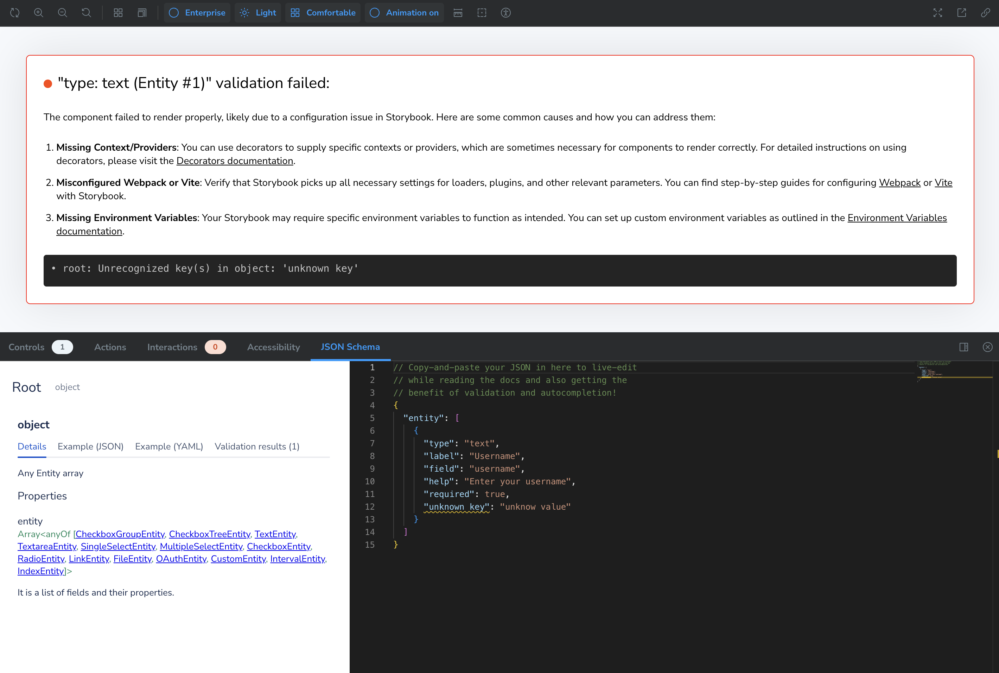

# User Playground

This is a live, interactive environment where you can preview and validate different entities that are used in Splunk UCC.

The Storybook playground is designed to:

- **Preview UCC form components** as they would appear in the actual app.
- Provide a **code editor panel** where you can tweak the entities in real-time.
- Validate the structure and content of each entity.

You can find the playground live [here](/addonfactory-ucc-generator/storybook/?path=/story/users-playground-custom-entity--text-field&viewMode=story&nav=false&addons=1&panel=true&toolbar=true)

---

## How to use Playground

Navigate to `Users Playground > Custom Entity > Code Panel` and replace the entity array with your own entity to check if any unknown key-value pair is present.

This story accepts a single `args` prop in the following format:

```ts
{
  entity: [
    {
      type: "text",
      label: "Username",
      field: "username",
      required: true,
    },
    // Add more entities as needed
  ];
}
```

> Note: If the output does not appear or fails to update after changes, try clicking the refresh button in the top-left corner of the Storybook UI to reload the playground or again copy-paste your updated code in the editor.

---

### Real-Time Validation

Each entity is validated against schema. If validation fails:

- You’ll see a custom UI **error**.
- The form will not render that entity.



### JSON Syntax Warnings

Since Storybook accepts already-parsed objects, you **won’t get syntax errors** like trailing commas.

When editing args in the Storybook UI:

- **Do not add trailing commas** (JavaScript may allow it, but JSON doesn’t).
- Use standard JSON syntax (quoted keys, double quotes for strings, etc.).

---
