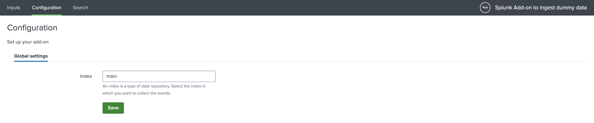
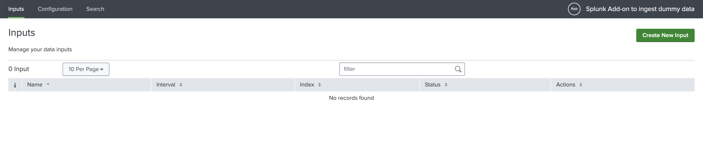

# Example

Let's assume that you want to create a simple Splunk add-on with UI to push 
some data to Splunk. In our example add-on we will push some dummy data just
to showcase the power of UCC.

If you want to try this example, all the files can be found in the [example 
folder](https://github.com/splunk/addonfactory-ucc-generator/tree/main/example)
in the repository itself.

The `globalConfig.json` file declares 2 pages:

* Configuration page is this example only has 1 tab, and it displays logging level
you want to have in your add-on.
* Input page has only 1 input available which will ingest some dummy data.

To build and package this add-on follow the steps [here](../quickstart/#steps-to-generate-the-add-on).

> After the add-on was built with `ucc-gen` you can copy the `dummy_input.py`
> into `package/bin` folder and make changes as you need.

In this example you already see the modified content of the modular input to 
ingest some dummy data.

Once you have built, packaged and installed the add-on, you need to restart 
Splunk. After that you can go to "Apps > Splunk Add-on to ingest dummy data" and 
check out the add-on. Below are the screenshot on how it should look like.

Configuration page:

Inputs page:

