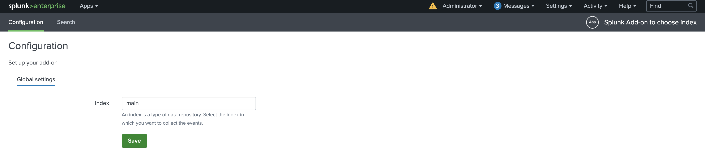

UCC usage
=========

Let's assume that you want to create a Splunk add-on with UI to specify Splunk
index that is going to be used in the add-on. Let's also assume that you do not
want to show indexes that are for internal use only (like, :code:`_internal`).

For this you can create a :code:`globalConfig.json` file and specify that you
want one configuration tab called "Global Settings", one UI component on that
tab that will handle index management and store selected index in specific
add-on configuration file.

.. literalinclude:: example/globalConfig.json
   :language: JSON

You also need a :code:`package` folder and :code:`app.manifest` inside it.

.. literalinclude:: example/app.manifest
   :language: JSON

As well as :code:`README.txt` and :code:`LICENSE.txt` files inside
:code:`package` folder. Those files may be empty to simplify the showcase of UCC.

To be able to utilise UI features of an add-on you need to create :code:`lib`
folder in :code:`package` folder and create :code:`requirements.txt`.

.. literalinclude:: example/requirements.txt
   :language: text

Now you are ready to run :code:`ucc-gen` command. If you don't have it installed,
please refer to :ref:`installation` section.

The structure of the add-on before running :code:`ucc-gen` command should be
like this:

::

    ├── globalConfig.json
    └── package
        ├── LICENSE.txt
        ├── README.txt
        ├── app.manifest
        └── lib
            └── requirements.txt

Let's assume we want to generate an add-on with version :code:`1.0.0`, to achieve
that we run:

.. code-block:: console

    ucc-gen --ta-version=1.0.0

After that, :code:`output` folder should be created. It should contain
:code:`Splunk_TA_choose_index` folder. And the structure of
:code:`Splunk_TA_choose_index` is following:

::

    Splunk_TA_choose_index
    ├── LICENSE.txt
    ├── README
    │   └── splunk_ta_choose_index_settings.conf.spec
    ├── README.txt
    ├── VERSION
    ├── app.manifest
    ├── appserver
    │   ├── static
    │   │   └── js
    │   │       └── build
    │   │           ├── 0.js
    │   │           ├── 0.licenses.txt
    │   │           ├── 1.js
    │   │           ├── 1.licenses.txt
    │   │           ├── 3.js
    │   │           ├── 3.licenses.txt
    │   │           ├── 4.js
    │   │           ├── 4.licenses.txt
    │   │           ├── entry_page.js
    │   │           ├── entry_page.licenses.txt
    │   │           └── globalConfig.json
    │   └── templates
    │       └── base.html
    ├── bin
    │   ├── Splunk_TA_choose_index_rh_settings.py
    │   └── import_declare_test.py
    ├── lib
    │   ├── <libraries>
    │   └── ...
    └── default
        ├── app.conf
        ├── data
        │   └── ui
        │       ├── nav
        │       │   └── default.xml
        │       └── views
        │           └── configuration.xml
        ├── restmap.conf
        ├── splunk_ta_choose_index_settings.conf
        └── web.conf

Now it's time to package our add-on and install it to Splunk. To install
:code:`slim` refer to :ref:`steps`.

To package this particular add-on run:

.. code-block:: console

    slim package output/Splunk_TA_choose_index

After it runs, you should see an archive created in the root folder of your
add-on. In our case, it should have name:
:code:`Splunk_TA_choose_index-1.0.0.tar.gz`.

This is an archive that can be loaded into Splunk through
"Apps > Manage Apps > Install app from file" interface.

Once you load it and restart Splunk, you can go to
"Apps > Splunk Add-on to choose index" and see interface like this one.

