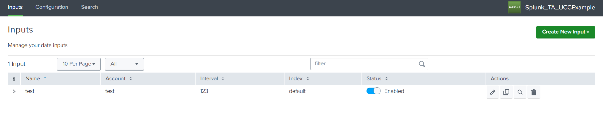

The input page stores configuration information for data collection. Multiple inputs can be created on the Inputs page.

Developers are required to add services in the global config file to create a new Input. If multiple services are provided, a dropdown field will appear on the Inputs page. In contrast, a button will be displayed for a single service.

### Properties

| Property                                                                  | Type   | Description                                                                                           |
| ------------------------------------------------------------------------- | ------ | ----------------------------------------------------------------------------------------------------- |
| title<span class="required-asterisk">\*</span>                            | string | -                                                                                                     |
| description                                                               | string | To provide a brief summary of an inputs page.                                                         |
| menu                                                                      | object | This property allows you to enable the [custom menu](../custom_ui_extensions/custom_menu.md) feature. |
| [table](../table)                                                         | object | To display input stanzas in a tabular format.                                                         |
| groupsMenu                                                                | array  | This property allows you to enable the [multi-level menu](./multilevel_menu.md) feature.              |
| [services](#services-properties)<span class="required-asterisk">\*</span> | array  | To specify a list of modular inputs.                                                                  |

### Services Properties

| Property                                                     | Type   | Description                                                                                                                                                                                        |
| ------------------------------------------------------------ | ------ | -------------------------------------------------------------------------------------------------------------------------------------------------------------------------------------------------- | --- |
| name<span class="required-asterisk">\*</span>                | string | To define the particular service name.                                                                                                                                                             |
| title<span class="required-asterisk">\*</span>               | string | To show the title of the service.                                                                                                                                                                  |
| subTitle                                                     | string | To show the subtitle (or additional information) of the service.                                                                                                                                   |
| [entity](../entity)<span class="required-asterisk">\*</span> | array  | A list of fields and their properties.                                                                                                                                                             |
| [groups](../advanced/groups_feature)                         | array  | It is used to divide forms into distinct sections, each comprising relevant fields.                                                                                                                |
| style                                                        | string | By specifying this property in the global config file, the forms can either be opened as a new page or in a dialog. <br>Supported values are "page" or "dialog". <br> Default value is **dialog**. |
| options                                                      | object | This property allows you to enable the [saveValidator](../advanced/save_validator) feature.                                                                                                        |
| hook                                                         | object | It is used to add custom behaviour to forms. Visit the [Custom Hook](../custom_ui_extensions/custom_hook) page to learn more.                                                                      |
| warning                                                      | object | It is used to add custom warning message for each of modes ('create', 'edit', 'config', 'clone'), message is displayed on form                                                                     |     |
| subDescription(../advanced/sub_description)                  | object | To provide broader description of an inputs page                                                                                                                                            |
| conf                                                         | string | TBD                                                                                                                                                                                                |
| restHandlerName                                              | string | TBD                                                                                                                                                                                                |
| restHandlerModule                                            | string | TBD                                                                                                                                                                                                |
| restHandlerClass                                             | string | TBD                                                                                                                                                                                                |

### Usage

This is how global config looks like without tabs:

```json
"pages": {
    "inputs": {
        "title": "Inputs",
        "description": "Manage your data inputs",
        "services": [
            {
                "name": "example_input_one",
                "title": "Example Input",
                "entity": []
            },
            {
                "name": "example_input_two",
                "title": "Example Input Two",
                "entity": []
            }
        ],
        "table": {
            "actions": [
                "edit",
                "enable",
                "delete",
                "clone"
            ],
            "header": [],
            "moreInfo": []
        }
    }
},
```

### Output

This is how it looks like in the UI:


