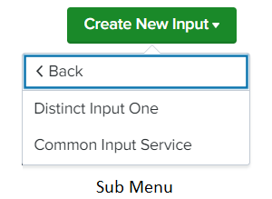

This feature allows us to organize the input services into different categories. As a result, each group/category will have a separate sub-menu that can include numerous types of input services. Inputs services can also belong to multiple groups/categories.

Using the [Custom Hook](../custom_ui_extensions/custom_hook.md), `groupName` can be saved in any form field for a specific inputs service stanza.

> `Tabs` and `Multi-level menu` feature cannot be used together.

### Usage

```json
"inputs": {
    "title": "Inputs",
    "table": {},
    "groupsMenu": [
        {
            "groupName": "group_one",
            "groupTitle": "Group One",
            "groupServices": ["example_input_one", "example_input_two"]
        },
        {
            "groupName": "example_input_three", 
            "groupTitle": "Example Input Three"
        },
        {
            "groupName": "group_two",
            "groupTitle": "Group Two",
            "groupServices": ["example_input_two", "example_input_four"]
        }
    ],
    "services": [
        {
            "name": "example_input_one",
            "title": "Distinct Input One"
            "entity": []
        },
        {
            "name": "example_input_two",
            "title": "Common Input Service"
            "entity": []
        },
        {
            "name": "example_input_three",
            "title": "Example Input Three"
            "entity": []
        },
        {
            "name": "example_input_four",
            "title": "Distinct Input Two"
            "entity": []
        }
    ]
}
```

> If `groupServices` is provided under a group, then all services listed in the array will be displayed in the sub-menu. If it is not provided, then that group will be considered as a service.

### Output

This is how it looks like in the UI:



