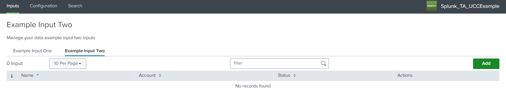

This feature allows us to separate inputs based on their service name. So, when multiple inputs services are provided in the global config file and if developers wish to display each input service in a separate tab (and table) they can make use of the tabs feature.

The `table` property must be present in the services to use the tabs feature.

If `title` and `description` are provided in the global config file then it would change when changing the tab.

### Usage

```json
"pages": {
    "inputs": {
        "title": "Inputs",
        "services": [
            {
                "name": "example_input_one",
                "description": "This is a description for Input One",
                "title": "Example Input",
                "entity": [],
                "table": {
                    "actions": [
                        "edit",
                        "enable",
                        "delete",
                        "clone"
                    ],
                    "header": [],
                    "moreInfo": []
                }
            },
            {
                "name": "example_input_two",
                "description": "This is a description for Input Two",
                "title": "Example Input Two",
                "entity": [],
                "table": {
                    "actions": [
                        "edit",
                        "enable",
                        "delete",
                        "clone"
                    ],
                    "header": [],
                    "moreInfo": [],
                    "customRow":{
                        "type": "external",
                        "src": "custom_row"
                    }
                }
            }
        ]
    }
},
```

> Note:
>
> When using the Tabs feature, if the `table`  or `description` property is provided in the `inputs`, the error ```instance.pages.inputs is not one of [subschema 0], [subschema 1]``` will be displayed.
>
> [Custom Menu](../../custom_ui_extensions/custom_menu/) is not supported with tabs feature.

### Output

This is how it looks like in the UI:

