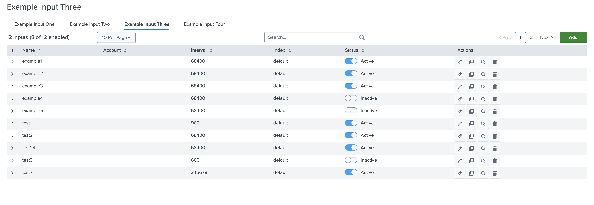

This feature allows you to separate inputs based on their service name. Use the tabs feature when multiple inputs services are provided in the global configuration file, and you want to display each input service in a separate tab (and table). 

The `table` property must be present in the services to use the tabs feature.

If `title` and `description` are provided in the global configuration file, then it would change when changing the tab.

### Usage

```json
"pages": {
    "inputs": {
        "title": "Inputs",
        "services": [
            {
                "name": "example_input_one",
                "description": "This is a description for Input One",
                "title": "Example Input",
                "entity": [],
                "table": {
                    "actions": [
                        "edit",
                        "enable",
                        "delete",
                        "clone"
                    ],
                    "header": [],
                    "moreInfo": []
                },
                "warning": {
                    "create": "Warning text for create mode",
                    "edit": "Warning text for edit mode",
                    "clone": "Warning text for clone mode",
                    "config": "Warning text for config mode",
                }
            },
            {
                "name": "example_input_two",
                "description": "This is a description for Input Two",
                "title": "Example Input Two",
                "entity": [],
                "table": {
                    "actions": [
                        "edit",
                        "enable",
                        "delete",
                        "clone"
                    ],
                    "header": [],
                    "moreInfo": [],
                    "customRow":{
                        "type": "external",
                        "src": "custom_row"
                    }
                }
            }
        ]
    }
},
```

> Note:
>
> When using the Tabs feature, if the `table`  or `description` property is provided in the `inputs`, the error ```instance.pages.inputs is not one of [subschema 0], [subschema 1]``` will be displayed.
>
> [Custom Menu](../../custom_ui_extensions/custom_menu/) is not supported with the tabs feature.

### Output

This is how it looks like in the UI:


