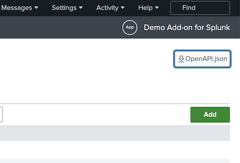

# OpenAPI description document

OpenAPI's description document is generated using the `ucc-gen` command. 
There has to be defined, valid `globalConfig.json` and `app.manifest` to have the document (`appserver/static/openapi.json` file) generated.

## How to find the document?

Once t`ucc-gen` command is executed, OpenAPI description document is located in the `appserver/static` output subdirectory.

One way to download it is through the button displayed on the top right corner of the configuration page.



When add-on is installed to Splunk instance, it is exposed via web and management interface, so is available under following addresses accordingly:

* \[protocol\]://\[domain\]:\[port\]/en-GB/static/app/\[appname\]/openapi.json

(eg. http://localhost:8000/en-GB/static/app/Splunk_TA_cisco_meraki/openapi.json)

See the following resources for more information on working with the Splunk REST API (for example, how to authenticate):

* [REST API User Manual](http://docs.splunk.com/Documentation/Splunk/9.0.3/RESTUM/RESTusing)
* [REST API Tutorials](http://docs.splunk.com/Documentation/Splunk/9.0.3/RESTTUT/RESTconfigurations)

## Where can it be used?

The OpenAPI Description document can be used to create:

* interactive documentation that generates simple curl requests to all documented endpoints (check [this section](#how-to-get-curl-commands-and-use-them) for the relevant instructions).
* automation that uses the simple requests to create more complex solutions such as:
    * orchestration
    * mass load or migration
    * automated tests.

Check [swagger](https://swagger.io/) or [other tools](https://github.com/OAI/OpenAPI-Specification/blob/main/IMPLEMENTATIONS.md) for more possibilities.

## How to get curl commands and use them?

### Prerequisites

* docker running
* Splunk with your add-on installed

### Instructions

1. Open https://editor.swagger.io/
   * Alternatively, you can run your own instance of Swagger Editor
     by running the following command in terminal:
     
     `docker run -p 8081:8080 swaggerapi/swagger-editor`
     
     Then go to: http://localhost:8081/
2. Load the OpenAPI description document (File > Import file)
3. Check domain and port values for your Splunk instance and Authorize
4. Select method-path pair (eg. GET - /splunk_ta_snow_settings/logging ) and "Try it out"
5. Define parameters and "Execute"
6. Copy curl value, paste to your terminal, ADD `-k` PARAMETER, and run

> See [Swagger Editor documentation](https://swagger.io/tools/swagger-editor/) for questions related to the tool.

### Troubleshooting

* SSL certificate problem

Make sure you added `-k` parameter to the curl command.

* Unauthorized

Make sure you clicked the Authorize button, gave the username and password, and then clicked Authorize.

## How do you generate Python client and then use it?

### Prerequisites

* Docker running
* Python installed
* Splunk with your add-on installed

### Instruction

1. Go to the directory where you downloaded `openapi.json` file
2. Run the following command: `docker run --rm -v ${PWD}:/local openapitools/openapi-generator-cli generate -i /local/openapi.json -g python -o /local/restapi_client`
   * make sure `openapi.json` is in the current directory
   * you can generate clients for other languages as well - run

     `docker run --rm openapitools/openapi-generator-cli generate list`

     to see the list of supported languages
3. The client should appear in `restapi_client`. Open that directory (`cd restapi_client`)
4. Install the client (`pip install .`)
5. See `README.md` for an example of usage

### Troubleshooting

In case of an SSL error (e.g. when connecting to localhost), you can disable verification:

```python
configuration = openapi_client.Configuration(
    host = "https://localhost:8089/servicesNS/-/addon-name",
    username = "user",
    password = "pass",
)

configuration.verify_ssl = False
```

This option should only be used when connecting to a non-prod Splunk instance.
