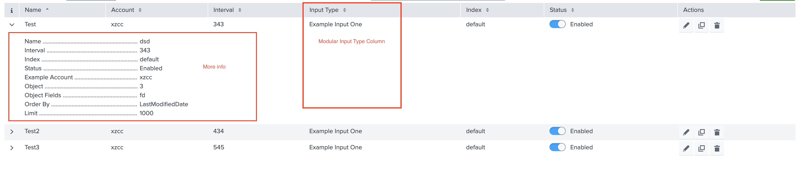

This is a common feature that is used to display the account and input stanzas on the [Inputs](inputs/index.md) and [Configuration](configurations/index.md) pages, respectively.

Tables include many built-in features such as sorting, filtering, and pagination.

### Properties

- `header`<span class="required-asterisk">*</span> (Array Objects) specifies the list of columns in the table.
    - `field`<span class="required-asterisk">*</span> is he name of the field where the column data will be displayed.
    - `label`<span class="required-asterisk">*</span> is the title of the column.
    - [mapping](advanced/custom_mapping.md) is used to map field values to more meaningful values.
    - [customCell](custom_ui_extensions/custom_cell.md) is used to modify the default cell values.
- `actions`<span class="required-asterisk">*</span> (Array) specifies  what type of action can be performed on the stanza. The supported types are `edit`, `clone`, and `delete`.
- `moreInfo` (Array Objects) specifies the list of fields that will be displayed in row form when the user clicks the Row Expand button.
    - `field` is used to dispaly the data in a column.
    - `label` is the title of the column.
    - [mapping](advanced/custom_mapping.md) is used to map field values to more meaningful values.
- [customRow](custom_ui_extensions/custom_row.md) can be used to customise the moreInfo Component.

### List of built-in table fields for Modular Input

If your add-on has multiple modular inputs and you want to show the input type of each one, use the following in-built field:

| Field Name   | description                                                                                     |
| ------------ | ----------------------------------------------------------------------------------------------- |
| serviceName  | It indicates the name of the Input service to be displayed in the table, for example, "example_input_one".  |
| serviceTitle | It indicates the title of the Input service to be displayed in the table, for example, "Example Input One". |

### Usage

```json
"table": {
    "header": [
        {
            "label": "Name",
            "field": "name"
        },
        {
            "label": "Account",
            "field": "account"
        },
        {
            "label": "Input Type",
            "field": "serviceTitle"
        },
        {
            "label": "Status",
            "field": "disabled"
        }
    ],
    "moreInfo": [
        {
            "label": "Name",
            "field": "name"
        },
        {
            "label": "Interval",
            "field": "interval"
        },
        {
            "label": "Index",
            "field": "index"
        },
        {
            "label": "Status",
            "field": "disabled",
            "mapping": {
                "true": "Disabled",
                "false": "Enabled"
            }
        },
        {
            "label": "Example Account",
            "field": "account"
        }
    ],
    "actions": ["edit", "enable", "delete", "clone"]
}
```

### Output

This is how it looks in the UI:


