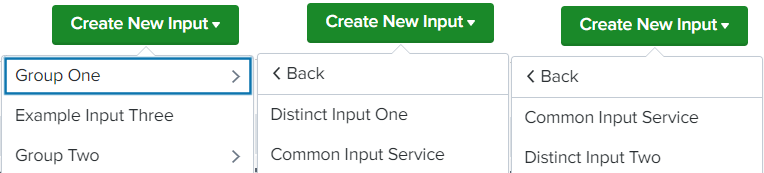

# Tabs

UCC currently supports 2 different types of tabs: "Configuration" and "Inputs".
"Search" tab is included by default.

## Configuration

"Configuration" tab can have multiple different subtabs, for example, a tab
for account configuration (name and API key), proxy configuration and logging
level configuration.

### Tabs Properties

| Property | Description |
| -------- | ----------- |
| style    | By specifying this property in the global config file, the forms can either be opened as a new page or in a dialog. <p>Supported values are "page" or "dialog".</p> <p> Default value is **dialog**. </p> |

## Inputs

Holds input configuration information for data collection.
If we have a variety of input configurations, we can create more than one input service under the input page.

If there are multiple services in the globalConfig file, a dropdown will appear on the Input page.
If there is only one service, a button will be displayed instead of a dropdown list to configure the input.

| Property          | Description |
| ----------------- | ----------- |
| style             | It is used to open the input service form in a page or dialog. The value of the style property can be `page` or `dialog`. <p> Default value is **dialog**. </p>  |

This is how globalConfig looks like without tabs on the inputs page:
```
"pages": {
    "inputs": {
        "title": "Inputs",
        "description": "Manage your data inputs",
        "services": [
            {
                "name": "example_input_one",
                "title": "Example Input",
                "entity": []
            },
            {
                "name": "example_input_two",
                "title": "Example Input Two",
                "entity": []
            }
        ],
        "table": {
            "actions": [
                "edit",
                "enable",
                "delete",
                "clone"
            ],
            "header": [],
            "moreInfo": []
        }
    }
},
```

### Tabs
If there are multiple types of input services and want to use the Tabs feature, each input service is represented by a separate tab. As a result, each input service will have its own tab.

To enable the tabs feature, `table` property must be provided under the services.

Title and Description would change when changing the tab (If provided in the globalConfig file).

```
"pages": {
    "inputs": {
        "title": "Inputs",
        "services": [
            {
                "name": "example_input_one",
                "description": "This is a description for Input One",
                "title": "Example Input",
                "entity": [],
                "table": {
                    "actions": [
                        "edit",
                        "enable",
                        "delete",
                        "clone"
                    ],
                    "header": [],
                    "moreInfo": []
                }
            },
            {
                "name": "example_input_two",
                "description": "This is a description for Input Two",
                "title": "Example Input Two",
                "entity": [],
                "table": {
                    "actions": [
                        "edit",
                        "enable",
                        "delete",
                        "clone"
                    ],
                    "header": [],
                    "moreInfo": [],
                    "customRow":{
                        "type": "external",
                        "src": "CustomRow"
                    }
                }
            }
        ]
    }
},
```

> Note:
>
> When using the Tabs feature, if the `table`  or `description` property is provided in the `inputs`, the error ```instance.pages.inputs is not one of [subschema 0], [subschema 1]``` will be displayed.
>
> [Custom menu](https://splunk.github.io/addonfactory-ucc-generator/custom_ui_extensions/custom_menu/) is not supported in the tabs feature.

### Multi-level Menu

This feature allows you to organize the input services into different categories. As a result, each group/category will have a separate sub-menu that can include numerous types of input services. Inputs services can also belong to multiple groups/categories.

#### Usage
```
"inputs": {
    "title": "Inputs",
    "table": {},
    "groupsMenu": [
        {
            "groupName": "group_one",
            "groupTitle": "Group One",
            "groupServices": ["example_input_one", "example_input_two"]
        },
        {
            "groupName": "example_input_three", 
            "groupTitle": "Example Input Three"
        },
        {
            "groupName": "group_two",
            "groupTitle": "Group Two",
            "groupServices": ["example_input_two", "example_input_four"]
        }
    ]
    "services": [
        {
            "name": "example_input_one",
            "title": "Distinct Input One"
            "entity": []
        },
        {
            "name": "example_input_two",
            "title": "Common Input Service"
            "entity": []
        },
        {
            "name": "example_input_three",
            "title": "Example Input Three"
            "entity": []
        },
        {
            "name": "example_input_four",
            "title": "Distinct Input Two"
            "entity": []
        }
    ]
}
```
> Note: If `groupServices` is provided under a group, then all services listed in the array will be displayed in the subMenu. If it is not provided, then that group will be considered as a service.

#### Output
This is how the Multi-level Menu will look:



> Note: 
>
> Using [Custom Hook](https://splunk.github.io/addonfactory-ucc-generator/custom_ui_extensions/custom_hook/), `groupName` can be saved in any form field for a specific inputs service stanza.
>
> Tabs and the multi-level menu cannot be used together.
