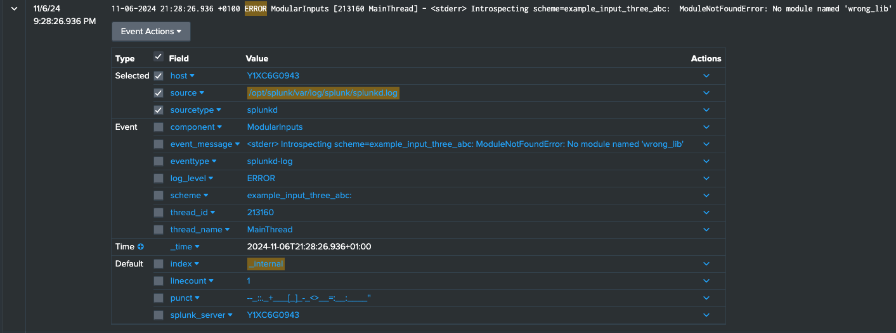

# Troubleshooting

## General troubleshooting

To be able to troubleshoot the Python part of the add-on, you can use `remote_pdb`. This can be used for the local development when you have locally installed the Splunk instance and add-on there.

Steps to set up:

* Put this [file](https://github.com/ionelmc/python-remote-pdb/blob/master/src/remote_pdb.py) in the `bin` folder
* Put this line, (`import remote_pdb; remote_pdb.RemotePdb(host="0.0.0.0", port=4444).set_trace()`), before the line that needs troubleshooting.
* Go to the console and run `telnet 127.0.0.1 4444`. It will open a `pdb` console, where you can start troubleshooting. Refer to the `pdb` documentation for the available commands.

## Splunk calls your modular input only once

If Splunk calls your modular input only once, however, you are
specifying an interval within, it should call your script. Check the
`use_single_instance` variable in the `get_scheme` method of your modular
input class. It should be set to False so that Splunk can schedule the
input accordingly.

Search for "index=_internal ExecProcessor" and look for
"interval: run once" near your script name in order to understand that Splunk does not schedule your modular
input script.

## ModuleNotFoundError: No module named '<library-name\>'

If you see this message in Splunk when your modular input is being run, it means that Splunk could not find a library that you are trying to import.

It can be because:

* there is no such library in the `package/lib` folder. Check your `package/lib/requirements.txt` file to make sure that you have it as part of the requirements.
* there is no `import import_declare_test` at the top of your modular input file. Add the mentioned import to the top of your modular input file.

## urllib3 >= 2

If you are getting an error (in `splunkd.log`)

```
ImportError: urllib3 v2.0 only supports OpenSSL 1.1.1+, currently the 'ssl' module is compiled with OpenSSL 1.0.2k-fips  26 Jan 2017.
See: https://github.com/urllib3/urllib3/issues/2168
```

when your modular input is running, you need to use `urllib3 < 2` in your `requirements.txt` file.

## Compare add-ons generated by 2 different versions of the `ucc-gen build`

`scripts` folder has a script, `compare_different_ucc_versions_output.sh`, which
can be used to compare the output of the add-on built by two different versions of
the `ucc-gen build` command.

To run it, copy the script to the add-on folder, and then read the
instructions in the script itself. If it does not work for your particular case,
feel free to adjust it yourself, or file a feature request for us to improve
something.

## Something went wrong


During the creation of the add-on, an error, such as incorrect import, unhandled exception etc., can be made in the code of modinput scripts.
When the add-on is built, this error is not caught and a package can be installed in Splunk without any problems. However, when you try to enter
the add-on page, you will see the message presented above. As this message is not
clear, it is not helpful in finding the root cause of the problem.

Fortunately, most errors are logged in Splunk on the internal indexes. One of these indexes is `_internal`.

First, search the `_internal` index for the word `ERROR` or `stderr`.
Usually the source of these logs is the `splunkd` process, so it can be used to pre-filter data.

`index = _internal source=*splunkd* ERROR` or `index = _internal source=*splunkd* stderr`

In the case of small infrastructures, this simple query can return information you need.

When the instances are large and they have many applications, each of them can have errors.
In addition, some errors are recorded only once when the add-on is installed, so it can be difficult to determine the correct time range.

In this case, you can narrow your search to a specific add-on. This may not be easy because no unique parameter is logged
that would easily filter out data for a specific add-on. However, you can use the `scheme` parameter, which is directly correlated with the names of inputs in the add-on.

The example of a logged error:


Schema logs the input name with a colon at the end, so use an asterisk after entering the name:

```
index = _internal source=*splunkd* 
(
   (component=ModularInputs stderr)
   OR component=ExecProcessor (scheme IN (example_input_one*, example_input_two*, example_input_three_abc*))
) ```Inputs scripts errors```
OR component="PersistentScript" ```Configuration scripts errors```
```

Or you can use a shortened version, using the wildcard mechanic:

```
index = _internal source=*splunkd* 
(
   (component=ModularInputs stderr)
   OR component=ExecProcessor (scheme IN (*example_input*))
) ```Inputs scripts errors```
OR component="PersistentScript" ```Configuration scripts errors```
```

Since in this example we are talking about errors coming from the modular input scripts,
another filtering factor, the `ModularInputs` component, is added. The `ExecProcessor` component is also included. It is responsible for running and managing scripts.
